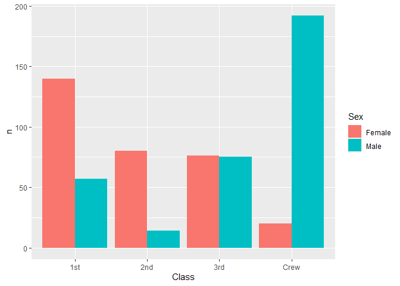
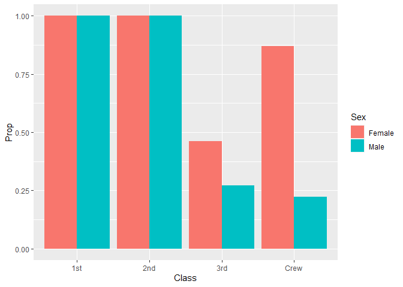
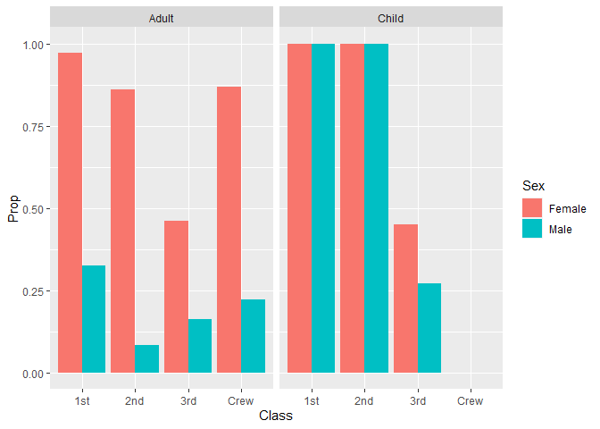

RMS Titanic
================
Olivia Chang
2023-1-30

- <a href="#grading-rubric" id="toc-grading-rubric">Grading Rubric</a>
  - <a href="#individual" id="toc-individual">Individual</a>
  - <a href="#due-date" id="toc-due-date">Due Date</a>
- <a href="#first-look" id="toc-first-look">First Look</a>
  - <a
    href="#q1-perform-a-glimpse-of-df_titanic-what-variables-are-in-this-dataset"
    id="toc-q1-perform-a-glimpse-of-df_titanic-what-variables-are-in-this-dataset"><strong>q1</strong>
    Perform a glimpse of <code>df_titanic</code>. What variables are in this
    dataset?</a>
  - <a
    href="#q2-skim-the-wikipedia-article-on-the-rms-titanic-and-look-for-a-total-count-of-souls-aboard-compare-against-the-total-computed-below-are-there-any-differences-are-those-differences-large-or-small-what-might-account-for-those-differences"
    id="toc-q2-skim-the-wikipedia-article-on-the-rms-titanic-and-look-for-a-total-count-of-souls-aboard-compare-against-the-total-computed-below-are-there-any-differences-are-those-differences-large-or-small-what-might-account-for-those-differences"><strong>q2</strong>
    Skim the Wikipedia article on the RMS Titanic, and look for a total
    count of souls aboard. Compare against the total computed below. Are
    there any differences? Are those differences large or small? What might
    account for those differences?</a>
  - <a
    href="#q3-create-a-plot-showing-the-count-of-persons-who-did-survive-along-with-aesthetics-for-class-and-sex-document-your-observations-below"
    id="toc-q3-create-a-plot-showing-the-count-of-persons-who-did-survive-along-with-aesthetics-for-class-and-sex-document-your-observations-below"><strong>q3</strong>
    Create a plot showing the count of persons who <em>did</em> survive,
    along with aesthetics for <code>Class</code> and <code>Sex</code>.
    Document your observations below.</a>
- <a href="#deeper-look" id="toc-deeper-look">Deeper Look</a>
  - <a
    href="#q4-replicate-your-visual-from-q3-but-display-prop-in-place-of-n-document-your-observations-and-note-any-newdifferent-observations-you-make-in-comparison-with-q3-is-there-anything-fishy-in-your-plot"
    id="toc-q4-replicate-your-visual-from-q3-but-display-prop-in-place-of-n-document-your-observations-and-note-any-newdifferent-observations-you-make-in-comparison-with-q3-is-there-anything-fishy-in-your-plot"><strong>q4</strong>
    Replicate your visual from q3, but display <code>Prop</code> in place of
    <code>n</code>. Document your observations, and note any new/different
    observations you make in comparison with q3. Is there anything
    <em>fishy</em> in your plot?</a>
  - <a
    href="#q5-create-a-plot-showing-the-group-proportion-of-occupants-who-did-survive-along-with-aesthetics-for-class-sex-and-age-document-your-observations-below"
    id="toc-q5-create-a-plot-showing-the-group-proportion-of-occupants-who-did-survive-along-with-aesthetics-for-class-sex-and-age-document-your-observations-below"><strong>q5</strong>
    Create a plot showing the group-proportion of occupants who <em>did</em>
    survive, along with aesthetics for <code>Class</code>, <code>Sex</code>,
    <em>and</em> <code>Age</code>. Document your observations below.</a>
- <a href="#notes" id="toc-notes">Notes</a>

*Purpose*: Most datasets have at least a few variables. Part of our task
in analyzing a dataset is to understand trends as they vary across these
different variables. Unless we’re careful and thorough, we can easily
miss these patterns. In this challenge you’ll analyze a dataset with a
small number of categorical variables and try to find differences among
the groups.

*Reading*: (Optional) [Wikipedia
article](https://en.wikipedia.org/wiki/RMS_Titanic) on the RMS Titanic.

<!-- include-rubric -->

# Grading Rubric

<!-- -------------------------------------------------- -->

Unlike exercises, **challenges will be graded**. The following rubrics
define how you will be graded, both on an individual and team basis.

## Individual

<!-- ------------------------- -->

| Category    | Needs Improvement                                                                                                | Satisfactory                                                                                                               |
|-------------|------------------------------------------------------------------------------------------------------------------|----------------------------------------------------------------------------------------------------------------------------|
| Effort      | Some task **q**’s left unattempted                                                                               | All task **q**’s attempted                                                                                                 |
| Observed    | Did not document observations, or observations incorrect                                                         | Documented correct observations based on analysis                                                                          |
| Supported   | Some observations not clearly supported by analysis                                                              | All observations clearly supported by analysis (table, graph, etc.)                                                        |
| Assessed    | Observations include claims not supported by the data, or reflect a level of certainty not warranted by the data | Observations are appropriately qualified by the quality & relevance of the data and (in)conclusiveness of the support      |
| Specified   | Uses the phrase “more data are necessary” without clarification                                                  | Any statement that “more data are necessary” specifies which *specific* data are needed to answer what *specific* question |
| Code Styled | Violations of the [style guide](https://style.tidyverse.org/) hinder readability                                 | Code sufficiently close to the [style guide](https://style.tidyverse.org/)                                                 |

## Due Date

<!-- ------------------------- -->

All the deliverables stated in the rubrics above are due **at midnight**
before the day of the class discussion of the challenge. See the
[Syllabus](https://docs.google.com/document/d/1qeP6DUS8Djq_A0HMllMqsSqX3a9dbcx1/edit?usp=sharing&ouid=110386251748498665069&rtpof=true&sd=true)
for more information.

``` r
library(tidyverse)
```

    ## ── Attaching packages ─────────────────────────────────────── tidyverse 1.3.2 ──
    ## ✔ ggplot2 3.4.1     ✔ purrr   1.0.1
    ## ✔ tibble  3.1.8     ✔ dplyr   1.1.0
    ## ✔ tidyr   1.3.0     ✔ stringr 1.5.0
    ## ✔ readr   2.1.4     ✔ forcats 1.0.0
    ## ── Conflicts ────────────────────────────────────────── tidyverse_conflicts() ──
    ## ✖ dplyr::filter() masks stats::filter()
    ## ✖ dplyr::lag()    masks stats::lag()

``` r
df_titanic <- as_tibble(Titanic)
```

*Background*: The RMS Titanic sank on its maiden voyage in 1912; about
67% of its passengers died.

# First Look

<!-- -------------------------------------------------- -->

### **q1** Perform a glimpse of `df_titanic`. What variables are in this dataset?

``` r
## TASK: Perform a `glimpse` of df_titanic
df_titanic %>% glimpse()
```

    ## Rows: 32
    ## Columns: 5
    ## $ Class    <chr> "1st", "2nd", "3rd", "Crew", "1st", "2nd", "3rd", "Crew", "1s…
    ## $ Sex      <chr> "Male", "Male", "Male", "Male", "Female", "Female", "Female",…
    ## $ Age      <chr> "Child", "Child", "Child", "Child", "Child", "Child", "Child"…
    ## $ Survived <chr> "No", "No", "No", "No", "No", "No", "No", "No", "No", "No", "…
    ## $ n        <dbl> 0, 0, 35, 0, 0, 0, 17, 0, 118, 154, 387, 670, 4, 13, 89, 3, 5…

``` r
df_titanic
```

    ## # A tibble: 32 × 5
    ##    Class Sex    Age   Survived     n
    ##    <chr> <chr>  <chr> <chr>    <dbl>
    ##  1 1st   Male   Child No           0
    ##  2 2nd   Male   Child No           0
    ##  3 3rd   Male   Child No          35
    ##  4 Crew  Male   Child No           0
    ##  5 1st   Female Child No           0
    ##  6 2nd   Female Child No           0
    ##  7 3rd   Female Child No          17
    ##  8 Crew  Female Child No           0
    ##  9 1st   Male   Adult No         118
    ## 10 2nd   Male   Adult No         154
    ## # … with 22 more rows

**Observations**:

- The variables in `df_titanic` are `Class`, `Sex`, `Age`, `Survived`,
  and `n`.

### **q2** Skim the [Wikipedia article](https://en.wikipedia.org/wiki/RMS_Titanic) on the RMS Titanic, and look for a total count of souls aboard. Compare against the total computed below. Are there any differences? Are those differences large or small? What might account for those differences?

``` r
## NOTE: No need to edit! We'll cover how to
## do this calculation in a later exercise.
df_titanic %>% summarize(total = sum(n))
```

    ## # A tibble: 1 × 1
    ##   total
    ##   <dbl>
    ## 1  2201

**Observations**:

According to the \[Wikipedia
article\](<https://en.wikipedia.org/wiki/RMS_Titanic>, there were an
estimated 2,224 passengers and crew aboard the Titanic. The `df_titanic`
data set has 2201 people in the set, which is a difference of 23
passengers. According to the article, the exact passenger list is not
clear because some people are double counted as they traveled under
aliases, and the list also included some names of people who cancelled
their trip at the last minute. This may account for the discrepancy in
the article and the dataframe.

### **q3** Create a plot showing the count of persons who *did* survive, along with aesthetics for `Class` and `Sex`. Document your observations below.

*Note*: There are many ways to do this.

``` r
df_titanic %>%
  filter(Survived == "Yes") %>%
   ggplot() + 
    geom_col(mapping = aes(x = Class, y = n, fill = Sex), position = "dodge")
```

<!-- -->

``` r
## TASK: Visualize counts against `Class` and `Sex`
```

**Observations**:

- In 1st and 2nd class, the raw count of female passengers that survived
  is greater than the raw count of male passengers that survived.
- In the 3rd class, approximately the same number of female and male
  passengers survived.
- In the Crew class, more male crew members survived than female crew
  members.
- The raw count of 1st class passengers that survived is greater than
  that of 2nd class passengers and 3rd class passengers.

# Deeper Look

<!-- ------------------------------------`-------------- -->

Raw counts give us a sense of totals, but they are not as useful for
understanding differences between groups. This is because the
differences we see in counts could be due to either the relative size of
the group OR differences in outcomes for those groups. To make
comparisons between groups, we should also consider *proportions*.\[1\]

The following code computes proportions within each `Class, Sex, Age`
group.

``` r
## NOTE: No need to edit! We'll cover how to
## do this calculation in a later exercise.
df_prop <-
  df_titanic %>%
  group_by(Class, Sex, Age) %>%
  mutate(
    Total = sum(n),
    Prop = n / Total
  ) %>%
  ungroup()
df_prop
```

    ## # A tibble: 32 × 7
    ##    Class Sex    Age   Survived     n Total    Prop
    ##    <chr> <chr>  <chr> <chr>    <dbl> <dbl>   <dbl>
    ##  1 1st   Male   Child No           0     5   0    
    ##  2 2nd   Male   Child No           0    11   0    
    ##  3 3rd   Male   Child No          35    48   0.729
    ##  4 Crew  Male   Child No           0     0 NaN    
    ##  5 1st   Female Child No           0     1   0    
    ##  6 2nd   Female Child No           0    13   0    
    ##  7 3rd   Female Child No          17    31   0.548
    ##  8 Crew  Female Child No           0     0 NaN    
    ##  9 1st   Male   Adult No         118   175   0.674
    ## 10 2nd   Male   Adult No         154   168   0.917
    ## # … with 22 more rows

### **q4** Replicate your visual from q3, but display `Prop` in place of `n`. Document your observations, and note any new/different observations you make in comparison with q3. Is there anything *fishy* in your plot?

``` r
df_prop %>%
  filter(Survived == "Yes") %>%
  ggplot() + 
  geom_col(mapping = aes(x = Class, y = Prop, fill = Sex), position = "dodge")
```

    ## Warning: Removed 2 rows containing missing values (`geom_col()`).

<!-- -->

**Observations**:

- According to the graph, 100% of 1st and 2nd class passengers survived,
  regardless of their sex.
- In 3rd class and Crew, the proportion of female people that survived
  is greater than the proportion of male people that survived. In the
  first plot, the raw count of female and male passengers in 3rd class
  that survived was approximately the same.
- In Crew, the proportion of female crew members that survived (\~0.87)
  is much greater than the proportion of male crew members that survived
  (\~0.23). This is in comparison to the first plot, where the raw count
  of male members in Crew that survived is much greater than the raw
  count of female members that survived.
- According to the plot, everyone in first class and second class
  survived, but from the `df_prop` tibble we can see that there are
  plenty of first class and second passengers that did not survive. For
  example, there are 118 1st-class male adults that did not survive.

### **q5** Create a plot showing the group-proportion of occupants who *did* survive, along with aesthetics for `Class`, `Sex`, *and* `Age`. Document your observations below.

*Hint*: Don’t forget that you can use `facet_grid` to help consider
additional variables!

``` r
df_prop %>%
  filter(Survived == "Yes") %>%
  ggplot() + 
  geom_col(mapping = aes(x = Class, y = Prop, fill = Sex), position = "dodge") +
  facet_grid(~ Age)
```

    ## Warning: Removed 2 rows containing missing values (`geom_col()`).

<!-- -->

**Observations**:

- The proportion of adults that survived is less than the proportion of
  children that survived, for both female and male passengers in 1st and
  2nd class.
- All of the children in the first and second class survived.
- There were no children in crew.
- The proportion of children that survived was much lower in 3rd class
  than 1st and 2nd class.
- In q4, it appeared that everyone in first and second class survived,
  even though that was not the case. This was because the q4 graph was
  overlaying the proportion of children that survived over the
  proportion of adults that survived, and the children-survival
  proportion (100%) was masking the adult-survival proportion for first
  and second class. Once the graphs were separated by age, we can see
  that the adult proportion of 1st and 2nd class that survived was less
  than 100%.

# Notes

<!-- -------------------------------------------------- -->

\[1\] This is basically the same idea as [Dimensional
Analysis](https://en.wikipedia.org/wiki/Dimensional_analysis); computing
proportions is akin to non-dimensionalizing a quantity.
