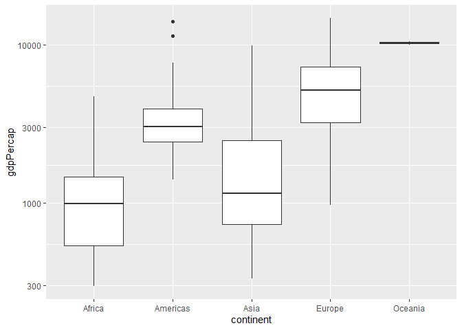
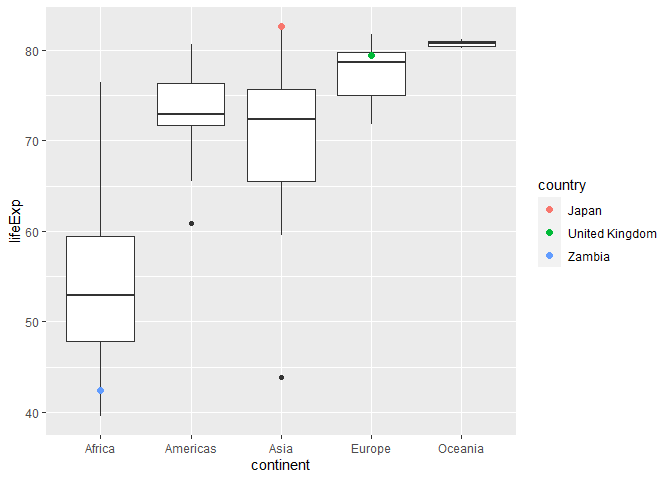
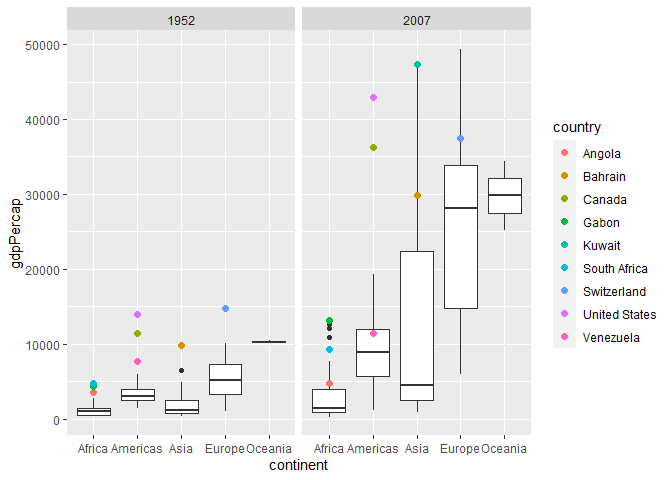
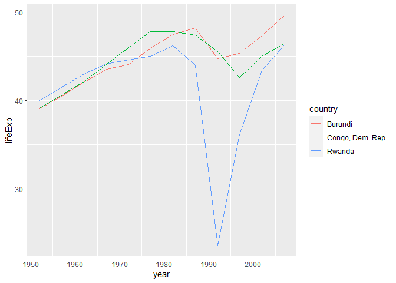
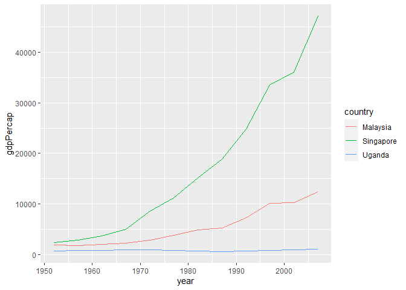
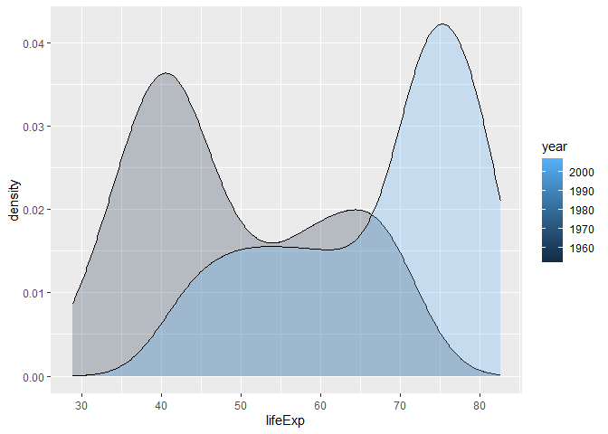

Gapminder
================
Olivia Chang
2023-2-22

- <a href="#grading-rubric" id="toc-grading-rubric">Grading Rubric</a>
  - <a href="#individual" id="toc-individual">Individual</a>
  - <a href="#due-date" id="toc-due-date">Due Date</a>
- <a href="#guided-eda" id="toc-guided-eda">Guided EDA</a>
  - <a
    href="#q0-perform-your-first-checks-on-the-dataset-what-variables-are-in-this"
    id="toc-q0-perform-your-first-checks-on-the-dataset-what-variables-are-in-this"><strong>q0</strong>
    Perform your “first checks” on the dataset. What variables are in
    this</a>
  - <a
    href="#q1-determine-the-most-and-least-recent-years-in-the-gapminder-dataset"
    id="toc-q1-determine-the-most-and-least-recent-years-in-the-gapminder-dataset"><strong>q1</strong>
    Determine the most and least recent years in the <code>gapminder</code>
    dataset.</a>
  - <a
    href="#q2-filter-on-years-matching-year_min-and-make-a-plot-of-the-gdp-per-capita-against-continent-choose-an-appropriate-geom_-to-visualize-the-data-what-observations-can-you-make"
    id="toc-q2-filter-on-years-matching-year_min-and-make-a-plot-of-the-gdp-per-capita-against-continent-choose-an-appropriate-geom_-to-visualize-the-data-what-observations-can-you-make"><strong>q2</strong>
    Filter on years matching <code>year_min</code>, and make a plot of the
    GDP per capita against continent. Choose an appropriate
    <code>geom_</code> to visualize the data. What observations can you
    make?</a>
  - <a
    href="#q3-you-should-have-found-at-least-three-outliers-in-q2-but-possibly-many-more-identify-those-outliers-figure-out-which-countries-they-are"
    id="toc-q3-you-should-have-found-at-least-three-outliers-in-q2-but-possibly-many-more-identify-those-outliers-figure-out-which-countries-they-are"><strong>q3</strong>
    You should have found <em>at least</em> three outliers in q2 (but
    possibly many more!). Identify those outliers (figure out which
    countries they are).</a>
  - <a
    href="#q4-create-a-plot-similar-to-yours-from-q2-studying-both-year_min-and-year_max-find-a-way-to-highlight-the-outliers-from-q3-on-your-plot-in-a-way-that-lets-you-identify-which-country-is-which-compare-the-patterns-between-year_min-and-year_max"
    id="toc-q4-create-a-plot-similar-to-yours-from-q2-studying-both-year_min-and-year_max-find-a-way-to-highlight-the-outliers-from-q3-on-your-plot-in-a-way-that-lets-you-identify-which-country-is-which-compare-the-patterns-between-year_min-and-year_max"><strong>q4</strong>
    Create a plot similar to yours from q2 studying both
    <code>year_min</code> and <code>year_max</code>. Find a way to highlight
    the outliers from q3 on your plot <em>in a way that lets you identify
    which country is which</em>. Compare the patterns between
    <code>year_min</code> and <code>year_max</code>.</a>
- <a href="#your-own-eda" id="toc-your-own-eda">Your Own EDA</a>
  - <a
    href="#q5-create-at-least-three-new-figures-below-with-each-figure-try-to-pose-new-questions-about-the-data"
    id="toc-q5-create-at-least-three-new-figures-below-with-each-figure-try-to-pose-new-questions-about-the-data"><strong>q5</strong>
    Create <em>at least</em> three new figures below. With each figure, try
    to pose new questions about the data.</a>

*Purpose*: Learning to do EDA well takes practice! In this challenge
you’ll further practice EDA by first completing a guided exploration,
then by conducting your own investigation. This challenge will also give
you a chance to use the wide variety of visual tools we’ve been
learning.

<!-- include-rubric -->

# Grading Rubric

<!-- -------------------------------------------------- -->

Unlike exercises, **challenges will be graded**. The following rubrics
define how you will be graded, both on an individual and team basis.

## Individual

<!-- ------------------------- -->

| Category    | Needs Improvement                                                                                                | Satisfactory                                                                                                               |
|-------------|------------------------------------------------------------------------------------------------------------------|----------------------------------------------------------------------------------------------------------------------------|
| Effort      | Some task **q**’s left unattempted                                                                               | All task **q**’s attempted                                                                                                 |
| Observed    | Did not document observations, or observations incorrect                                                         | Documented correct observations based on analysis                                                                          |
| Supported   | Some observations not clearly supported by analysis                                                              | All observations clearly supported by analysis (table, graph, etc.)                                                        |
| Assessed    | Observations include claims not supported by the data, or reflect a level of certainty not warranted by the data | Observations are appropriately qualified by the quality & relevance of the data and (in)conclusiveness of the support      |
| Specified   | Uses the phrase “more data are necessary” without clarification                                                  | Any statement that “more data are necessary” specifies which *specific* data are needed to answer what *specific* question |
| Code Styled | Violations of the [style guide](https://style.tidyverse.org/) hinder readability                                 | Code sufficiently close to the [style guide](https://style.tidyverse.org/)                                                 |

## Due Date

<!-- ------------------------- -->

All the deliverables stated in the rubrics above are due **at midnight**
before the day of the class discussion of the challenge. See the
[Syllabus](https://docs.google.com/document/d/1qeP6DUS8Djq_A0HMllMqsSqX3a9dbcx1/edit?usp=sharing&ouid=110386251748498665069&rtpof=true&sd=true)
for more information.

``` r
library(tidyverse)
```

    ## ── Attaching packages ─────────────────────────────────────── tidyverse 1.3.2 ──
    ## ✔ ggplot2 3.4.1     ✔ purrr   1.0.1
    ## ✔ tibble  3.1.8     ✔ dplyr   1.1.0
    ## ✔ tidyr   1.3.0     ✔ stringr 1.5.0
    ## ✔ readr   2.1.4     ✔ forcats 1.0.0
    ## ── Conflicts ────────────────────────────────────────── tidyverse_conflicts() ──
    ## ✖ dplyr::filter() masks stats::filter()
    ## ✖ dplyr::lag()    masks stats::lag()

``` r
library(gapminder)
```

*Background*: [Gapminder](https://www.gapminder.org/about-gapminder/) is
an independent organization that seeks to educate people about the state
of the world. They seek to counteract the worldview constructed by a
hype-driven media cycle, and promote a “fact-based worldview” by
focusing on data. The dataset we’ll study in this challenge is from
Gapminder.

# Guided EDA

<!-- -------------------------------------------------- -->

First, we’ll go through a round of *guided EDA*. Try to pay attention to
the high-level process we’re going through—after this guided round
you’ll be responsible for doing another cycle of EDA on your own!

### **q0** Perform your “first checks” on the dataset. What variables are in this

dataset?

``` r
## TASK: Do your "first checks" here!

glimpse(gapminder)
```

    ## Rows: 1,704
    ## Columns: 6
    ## $ country   <fct> "Afghanistan", "Afghanistan", "Afghanistan", "Afghanistan", …
    ## $ continent <fct> Asia, Asia, Asia, Asia, Asia, Asia, Asia, Asia, Asia, Asia, …
    ## $ year      <int> 1952, 1957, 1962, 1967, 1972, 1977, 1982, 1987, 1992, 1997, …
    ## $ lifeExp   <dbl> 28.801, 30.332, 31.997, 34.020, 36.088, 38.438, 39.854, 40.8…
    ## $ pop       <int> 8425333, 9240934, 10267083, 11537966, 13079460, 14880372, 12…
    ## $ gdpPercap <dbl> 779.4453, 820.8530, 853.1007, 836.1971, 739.9811, 786.1134, …

``` r
summary(gapminder)
```

    ##         country        continent        year         lifeExp     
    ##  Afghanistan:  12   Africa  :624   Min.   :1952   Min.   :23.60  
    ##  Albania    :  12   Americas:300   1st Qu.:1966   1st Qu.:48.20  
    ##  Algeria    :  12   Asia    :396   Median :1980   Median :60.71  
    ##  Angola     :  12   Europe  :360   Mean   :1980   Mean   :59.47  
    ##  Argentina  :  12   Oceania : 24   3rd Qu.:1993   3rd Qu.:70.85  
    ##  Australia  :  12                  Max.   :2007   Max.   :82.60  
    ##  (Other)    :1632                                                
    ##       pop              gdpPercap       
    ##  Min.   :6.001e+04   Min.   :   241.2  
    ##  1st Qu.:2.794e+06   1st Qu.:  1202.1  
    ##  Median :7.024e+06   Median :  3531.8  
    ##  Mean   :2.960e+07   Mean   :  7215.3  
    ##  3rd Qu.:1.959e+07   3rd Qu.:  9325.5  
    ##  Max.   :1.319e+09   Max.   :113523.1  
    ## 

**Observations**:

- Variables in gapminder: country, continent, year, lifeExp, pop,
  gdpPercap
- For each country, there is gdpPercap, pop, and lifeExp data for each
  year from 1952 to 2007.

### **q1** Determine the most and least recent years in the `gapminder` dataset.

*Hint*: Use the `pull()` function to get a vector out of a tibble.
(Rather than the `$` notation of base R.)

``` r
## TASK: Find the largest and smallest values of `year` in `gapminder`
year_max <- gapminder %>%
  pull(year) %>%
  max()
year_min <- gapminder %>%
  pull(year) %>%
  min()
```

Use the following test to check your work.

``` r
## NOTE: No need to change this
assertthat::assert_that(year_max %% 7 == 5)
```

    ## [1] TRUE

``` r
assertthat::assert_that(year_max %% 3 == 0)
```

    ## [1] TRUE

``` r
assertthat::assert_that(year_min %% 7 == 6)
```

    ## [1] TRUE

``` r
assertthat::assert_that(year_min %% 3 == 2)
```

    ## [1] TRUE

``` r
if (is_tibble(year_max)) {
  print("year_max is a tibble; try using `pull()` to get a vector")
  assertthat::assert_that(False)
}

print("Nice!")
```

    ## [1] "Nice!"

### **q2** Filter on years matching `year_min`, and make a plot of the GDP per capita against continent. Choose an appropriate `geom_` to visualize the data. What observations can you make?

You may encounter difficulties in visualizing these data; if so document
your challenges and attempt to produce the most informative visual you
can.

``` r
## TASK: Create a visual of gdpPercap vs continent
gapminder %>%
  filter(year == year_min & gdpPercap < 60000) %>%
  ggplot() +
    geom_boxplot(mapping = aes(x = continent, y = gdpPercap))
```

<!-- -->
Note: for visual clarity, this graph is missing Kuwait, which had a
gdpPercap of 108382.353 in 1952.

**Observations**:

- In 1952, European countries had a higher median gdp per capita than
  Africa, Asia, and the Americas.
- There is a large outlier in gdp per capita in Asian countries.  
- The distribution of gdp per capita is skewed right for each country.

**Difficulties & Approaches**:

- The large outlier in the Asian countries category makes it difficult
  to make out the rest of the data, since the rest of the data gets
  “squished”.
- I tried a violin plot on top of a box plot, so that it’s easier to see
  the distribution in each continent, but also allows you to easily
  identify the outliers. According to R Graph, it is relatively common
  to introduce a violin plot to see both the distribution of the data
  and its summary statistics. However, I still didn’t like how difficult
  it was to distinguish between different observations.
- Finally, I filtered out countries with a gdpPercap \> 60,000, which
  eliminated one outlier country (Kuwait). Even though the graph is then
  missing one data point, it made it much easier to visually distinguish
  between the Q1 line, median line, and Q3 lines for each continent,
  which I thought was a worthwhile tradeoff.

### **q3** You should have found *at least* three outliers in q2 (but possibly many more!). Identify those outliers (figure out which countries they are).

``` r
outliers <- gapminder %>% 
  filter(year == year_min) %>%
  group_by(continent) %>% 
  mutate(
    gdpPercap_iqr = IQR(gdpPercap),
    gdpPercap_25 = quantile(gdpPercap, probs=0.25, na.rm=TRUE),
    gdpPercap_75 = quantile(gdpPercap, probs=0.75, na.rm=TRUE)
  ) %>%
  mutate(
    gdpPercap_outlier_bound_low = gdpPercap_25 - gdpPercap_iqr * 1.5,
    gdpPercap_outlier_bound_high = gdpPercap_iqr * 1.5 + gdpPercap_75
  ) %>%
  filter(gdpPercap > gdpPercap_outlier_bound_high | gdpPercap < gdpPercap_outlier_bound_low)

outliers
```

    ## # A tibble: 9 × 11
    ## # Groups:   continent [4]
    ##   country   conti…¹  year lifeExp    pop gdpPe…² gdpPe…³ gdpPe…⁴ gdpPe…⁵ gdpPe…⁶
    ##   <fct>     <fct>   <int>   <dbl>  <int>   <dbl>   <dbl>   <dbl>   <dbl>   <dbl>
    ## 1 Angola    Africa   1952    30.0 4.23e6   3521.    920.    535.   1455.   -845.
    ## 2 Bahrain   Asia     1952    50.9 1.20e5   9867.   2286.    750.   3035.  -2679.
    ## 3 Canada    Americ…  1952    68.8 1.48e7  11367.   1512.   2428.   3940.    161.
    ## 4 Gabon     Africa   1952    37.0 4.21e5   4293.    920.    535.   1455.   -845.
    ## 5 Kuwait    Asia     1952    55.6 1.6 e5 108382.   2286.    750.   3035.  -2679.
    ## 6 South Af… Africa   1952    45.0 1.43e7   4725.    920.    535.   1455.   -845.
    ## 7 Switzerl… Europe   1952    69.6 4.82e6  14734.   3996.   3241.   7237.  -2752.
    ## 8 United S… Americ…  1952    68.4 1.58e8  13990.   1512.   2428.   3940.    161.
    ## 9 Venezuela Americ…  1952    55.1 5.44e6   7690.   1512.   2428.   3940.    161.
    ## # … with 1 more variable: gdpPercap_outlier_bound_high <dbl>, and abbreviated
    ## #   variable names ¹​continent, ²​gdpPercap, ³​gdpPercap_iqr, ⁴​gdpPercap_25,
    ## #   ⁵​gdpPercap_75, ⁶​gdpPercap_outlier_bound_low

**Observations**:

- The countries that are outliers on gdpPercap in the year 1952 are
  Angola, Bahrain, Canada, Gabon, Kuwait, South Africa, Switzerland,
  United States, and Venezuela.

*Hint*: For the next task, it’s helpful to know a ggplot trick we’ll
learn in an upcoming exercise: You can use the `data` argument inside
any `geom_*` to modify the data that will be plotted *by that geom
only*. For instance, you can use this trick to filter a set of points to
label:

``` r
## NOTE: No need to edit, use ideas from this in q4 below
gapminder %>%
  filter(year == max(year)) %>%

  ggplot(aes(continent, lifeExp)) +
  geom_boxplot() +
  geom_point(
    data = . %>%  filter(country %in% c("United Kingdom", "Japan", "Zambia")),
    mapping = aes(color = country),
    size = 2
  )
```

<!-- -->

### **q4** Create a plot similar to yours from q2 studying both `year_min` and `year_max`. Find a way to highlight the outliers from q3 on your plot *in a way that lets you identify which country is which*. Compare the patterns between `year_min` and `year_max`.

*Hint*: We’ve learned a lot of different ways to show multiple
variables; think about using different aesthetics or facets.

``` r
## TASK: Create a visual of gdpPercap vs continent
gapminder %>%
  filter(gdpPercap < 60000 & year == year_min | year == year_max) %>%
  ggplot(mapping = aes(x = continent, y = gdpPercap)) +
    geom_boxplot() +
    geom_point(
      data = . %>%  filter(country %in% c(outliers %>% pull(country))),
      mapping = aes(color = country),
      size = 2
    ) +
    facet_wrap( .~ year)
```

<!-- -->

**Observations**:

- Many of the outlier countries in 1952 are still outliers in 2007,
  including Gabon, Canada, and the United States. On the other hand,
  Bahrain, South Africa, and Venezuela are no longer outliers in 2007
  with their gdpPercap.
- The distribution of gdpPercap in has widened for every continent, but
  particularly in both Asia and Europe, from 1952 to 2007.
- The 75th percentile gdpPercap in Asia has increased a lot from 1952 to
  2007, and is now greater than the 75th percentile gdpPercap in the
  Americas.
- The median gdpPercap in Eruope and Oceania has increased quite a bit
  from 1952 to 2007.

# Your Own EDA

<!-- -------------------------------------------------- -->

Now it’s your turn! We just went through guided EDA considering the GDP
per capita at two time points. You can continue looking at outliers,
consider different years, repeat the exercise with `lifeExp`, consider
the relationship between variables, or something else entirely.

### **q5** Create *at least* three new figures below. With each figure, try to pose new questions about the data.

``` r
gapminder %>%
  filter(country == "Burundi" | country == "Rwanda" | country == "Congo, Dem. Rep.") %>%
  ggplot(mapping = aes(x = year, y = lifeExp)) +
    geom_line(mapping = aes(color = country))
```

<!-- -->

- This graph displays life expectancy vs. year for three African
  countries that were once Belgian colonies: Burundi, the DRC, and
  Rwanda.
- Life expectancy is generally increasing over time, but all three
  countries have a dip in life expectancy in the 1990s. What is the
  reason for each dip in life expectancy, and why do all three dips
  happen in the same decade?
- In particular, Rwanda shows a sharp dip to a life expectancy below 25
  years around approximately 1992, which may be due to the Rwandan
  genocide.
- For each country, is life expectancy increasing at a greater rate in
  the 2000s compared to the 1950s?

``` r
gapminder %>%
  filter(country == "Uganda" | country == "Singapore" | country == "Malaysia") %>%
  ggplot(mapping = aes(x = year, y = gdpPercap)) +
    geom_line(mapping = aes(color = country))
```

<!-- -->

- This graph displays gdp per capita over time for three former British
  colonies: Malaysia, Singapore, and Uganda.
- Singapore’s gdp per capita has increased at a much faster rate than
  Malaysia and Uganda. Relative to Malaysia and Singapore, Uganda’s gdp
  per capita has remained relatively flat over time.
- The rate of growth for gdp per capita flattens slightly for Singapore
  around 1997 and flattens out for Malaysia that same year. What could
  be the cause of that flattening? Do all Southeast Asian countries show
  that flattening?

``` r
gapminder %>%
  filter(year == year_min | year == year_max) %>%
  ggplot(mapping = aes(x = lifeExp, group = year, fill = year)) +
    geom_density(alpha = 0.25)
```

<!-- -->

- In 1952, there are two peaks in the life expectancy curve, one
  prominent peak around 40 years and another less prominent bump around
  65 years. It is right skewed.
- In 2007, the life expectancy curve has shifted rightwards, and there
  is one prominent peak around 75 years. It is left skewed.
- In 1952, are the countries in the peak around 40 years primarily
  countries in the “Global South” (countries that were colonized)? How
  many of those countries saw a large jump in life expectancy from 1952
  to 2007?
