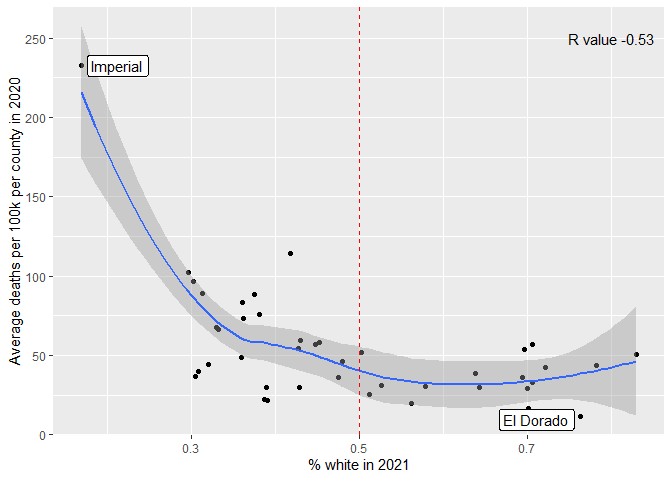

COVID-19
================
Olivia Chang
2023-03-21

- <a href="#grading-rubric" id="toc-grading-rubric">Grading Rubric</a>
  - <a href="#individual" id="toc-individual">Individual</a>
  - <a href="#due-date" id="toc-due-date">Due Date</a>
- <a href="#the-big-picture" id="toc-the-big-picture">The Big Picture</a>
- <a href="#get-the-data" id="toc-get-the-data">Get the Data</a>
  - <a href="#navigating-the-census-bureau"
    id="toc-navigating-the-census-bureau">Navigating the Census Bureau</a>
    - <a
      href="#q1-load-table-b01003-into-the-following-tibble-make-sure-the-column-names-are-id-geographic-area-name-estimatetotal-margin-of-errortotal"
      id="toc-q1-load-table-b01003-into-the-following-tibble-make-sure-the-column-names-are-id-geographic-area-name-estimatetotal-margin-of-errortotal"><strong>q1</strong>
      Load Table <code>B01003</code> into the following tibble. Make sure the
      column names are
      <code>id, Geographic Area Name, Estimate!!Total, Margin of Error!!Total</code>.</a>
  - <a href="#automated-download-of-nyt-data"
    id="toc-automated-download-of-nyt-data">Automated Download of NYT
    Data</a>
    - <a
      href="#q2-visit-the-nyt-github-repo-and-find-the-url-for-the-raw-us-county-level-data-assign-that-url-as-a-string-to-the-variable-below"
      id="toc-q2-visit-the-nyt-github-repo-and-find-the-url-for-the-raw-us-county-level-data-assign-that-url-as-a-string-to-the-variable-below"><strong>q2</strong>
      Visit the NYT GitHub repo and find the URL for the <strong>raw</strong>
      US County-level data. Assign that URL as a string to the variable
      below.</a>
- <a href="#join-the-data" id="toc-join-the-data">Join the Data</a>
  - <a href="#q3-process-the-id-column-of-df_pop-to-create-a-fips-column"
    id="toc-q3-process-the-id-column-of-df_pop-to-create-a-fips-column"><strong>q3</strong>
    Process the <code>id</code> column of <code>df_pop</code> to create a
    <code>fips</code> column.</a>
  - <a
    href="#q4-join-df_covid-with-df_q3-by-the-fips-column-use-the-proper-type-of-join-to-preserve-only-the-rows-in-df_covid"
    id="toc-q4-join-df_covid-with-df_q3-by-the-fips-column-use-the-proper-type-of-join-to-preserve-only-the-rows-in-df_covid"><strong>q4</strong>
    Join <code>df_covid</code> with <code>df_q3</code> by the
    <code>fips</code> column. Use the proper type of join to preserve
    <em>only</em> the rows in <code>df_covid</code>.</a>
- <a href="#analyze" id="toc-analyze">Analyze</a>
  - <a href="#normalize" id="toc-normalize">Normalize</a>
    - <a
      href="#q5-use-the-population-estimates-in-df_data-to-normalize-cases-and-deaths-to-produce-per-100000-counts-3-store-these-values-in-the-columns-cases_per100k-and-deaths_per100k"
      id="toc-q5-use-the-population-estimates-in-df_data-to-normalize-cases-and-deaths-to-produce-per-100000-counts-3-store-these-values-in-the-columns-cases_per100k-and-deaths_per100k"><strong>q5</strong>
      Use the <code>population</code> estimates in <code>df_data</code> to
      normalize <code>cases</code> and <code>deaths</code> to produce per
      100,000 counts [3]. Store these values in the columns
      <code>cases_per100k</code> and <code>deaths_per100k</code>.</a>
  - <a href="#guided-eda" id="toc-guided-eda">Guided EDA</a>
    - <a
      href="#q6-compute-the-mean-and-standard-deviation-for-cases_per100k-and-deaths_per100k"
      id="toc-q6-compute-the-mean-and-standard-deviation-for-cases_per100k-and-deaths_per100k"><strong>q6</strong>
      Compute the mean and standard deviation for <code>cases_per100k</code>
      and <code>deaths_per100k</code>.</a>
    - <a
      href="#q7-find-the-top-10-counties-in-terms-of-cases_per100k-and-the-top-10-in-terms-of-deaths_per100k-report-the-population-of-each-county-along-with-the-per-100000-counts-compare-the-counts-against-the-mean-values-you-found-in-q6-note-any-observations"
      id="toc-q7-find-the-top-10-counties-in-terms-of-cases_per100k-and-the-top-10-in-terms-of-deaths_per100k-report-the-population-of-each-county-along-with-the-per-100000-counts-compare-the-counts-against-the-mean-values-you-found-in-q6-note-any-observations"><strong>q7</strong>
      Find the top 10 counties in terms of <code>cases_per100k</code>, and the
      top 10 in terms of <code>deaths_per100k</code>. Report the population of
      each county along with the per-100,000 counts. Compare the counts
      against the mean values you found in q6. Note any observations.</a>
  - <a href="#self-directed-eda" id="toc-self-directed-eda">Self-directed
    EDA</a>
    - <a
      href="#q8-drive-your-own-ship-youve-just-put-together-a-very-rich-dataset-you-now-get-to-explore-pick-your-own-direction-and-generate-at-least-one-punchline-figure-to-document-an-interesting-finding-i-give-a-couple-tips--ideas-below"
      id="toc-q8-drive-your-own-ship-youve-just-put-together-a-very-rich-dataset-you-now-get-to-explore-pick-your-own-direction-and-generate-at-least-one-punchline-figure-to-document-an-interesting-finding-i-give-a-couple-tips--ideas-below"><strong>q8</strong>
      Drive your own ship: You’ve just put together a very rich dataset; you
      now get to explore! Pick your own direction and generate at least one
      punchline figure to document an interesting finding. I give a couple
      tips &amp; ideas below:</a>
    - <a href="#ideas" id="toc-ideas">Ideas</a>
    - <a href="#aside-some-visualization-tricks"
      id="toc-aside-some-visualization-tricks">Aside: Some visualization
      tricks</a>
    - <a href="#geographic-exceptions"
      id="toc-geographic-exceptions">Geographic exceptions</a>
- <a href="#notes" id="toc-notes">Notes</a>

*Purpose*: In this challenge, you’ll learn how to navigate the U.S.
Census Bureau website, programmatically download data from the internet,
and perform a county-level population-weighted analysis of current
COVID-19 trends. This will give you the base for a very deep
investigation of COVID-19, which we’ll build upon for Project 1.

<!-- include-rubric -->

# Grading Rubric

<!-- -------------------------------------------------- -->

Unlike exercises, **challenges will be graded**. The following rubrics
define how you will be graded, both on an individual and team basis.

## Individual

<!-- ------------------------- -->

| Category    | Needs Improvement                                                                                                | Satisfactory                                                                                                               |
|-------------|------------------------------------------------------------------------------------------------------------------|----------------------------------------------------------------------------------------------------------------------------|
| Effort      | Some task **q**’s left unattempted                                                                               | All task **q**’s attempted                                                                                                 |
| Observed    | Did not document observations, or observations incorrect                                                         | Documented correct observations based on analysis                                                                          |
| Supported   | Some observations not clearly supported by analysis                                                              | All observations clearly supported by analysis (table, graph, etc.)                                                        |
| Assessed    | Observations include claims not supported by the data, or reflect a level of certainty not warranted by the data | Observations are appropriately qualified by the quality & relevance of the data and (in)conclusiveness of the support      |
| Specified   | Uses the phrase “more data are necessary” without clarification                                                  | Any statement that “more data are necessary” specifies which *specific* data are needed to answer what *specific* question |
| Code Styled | Violations of the [style guide](https://style.tidyverse.org/) hinder readability                                 | Code sufficiently close to the [style guide](https://style.tidyverse.org/)                                                 |

## Due Date

<!-- ------------------------- -->

All the deliverables stated in the rubrics above are due **at midnight**
before the day of the class discussion of the challenge. See the
[Syllabus](https://docs.google.com/document/d/1qeP6DUS8Djq_A0HMllMqsSqX3a9dbcx1/edit?usp=sharing&ouid=110386251748498665069&rtpof=true&sd=true)
for more information.

``` r
library(tidyverse)
```

    ## ── Attaching packages ─────────────────────────────────────── tidyverse 1.3.2 ──
    ## ✔ ggplot2 3.4.1     ✔ purrr   1.0.1
    ## ✔ tibble  3.1.8     ✔ dplyr   1.1.0
    ## ✔ tidyr   1.3.0     ✔ stringr 1.5.0
    ## ✔ readr   2.1.4     ✔ forcats 1.0.0
    ## ── Conflicts ────────────────────────────────────────── tidyverse_conflicts() ──
    ## ✖ dplyr::filter() masks stats::filter()
    ## ✖ dplyr::lag()    masks stats::lag()

*Background*:
[COVID-19](https://en.wikipedia.org/wiki/Coronavirus_disease_2019) is
the disease caused by the virus SARS-CoV-2. In 2020 it became a global
pandemic, leading to huge loss of life and tremendous disruption to
society. The New York Times (as of writing) publishes up-to-date data on
the progression of the pandemic across the United States—we will study
these data in this challenge.

*Optional Readings*: I’ve found this [ProPublica
piece](https://www.propublica.org/article/how-to-understand-covid-19-numbers)
on “How to understand COVID-19 numbers” to be very informative!

# The Big Picture

<!-- -------------------------------------------------- -->

We’re about to go through *a lot* of weird steps, so let’s first fix the
big picture firmly in mind:

We want to study COVID-19 in terms of data: both case counts (number of
infections) and deaths. We’re going to do a county-level analysis in
order to get a high-resolution view of the pandemic. Since US counties
can vary widely in terms of their population, we’ll need population
estimates in order to compute infection rates (think back to the
`Titanic` challenge).

That’s the high-level view; now let’s dig into the details.

# Get the Data

<!-- -------------------------------------------------- -->

1.  County-level population estimates (Census Bureau)
2.  County-level COVID-19 counts (New York Times)

## Navigating the Census Bureau

<!-- ------------------------- -->

**Steps**: Our objective is to find the 2018 American Community
Survey\[1\] (ACS) Total Population estimates, disaggregated by counties.
To check your results, this is Table `B01003`.

1.  Go to [data.census.gov](data.census.gov).
2.  Scroll down and click `View Tables`.
3.  Apply filters to find the ACS **Total Population** estimates,
    disaggregated by counties. I used the filters:

- `Topics > Populations and People > Counts, Estimates, and Projections > Population Total`
- `Geography > County > All counties in United States`

5.  Select the **Total Population** table and click the `Download`
    button to download the data; make sure to select the 2018 5-year
    estimates.
6.  Unzip and move the data to your `challenges/data` folder.

- Note that the data will have a crazy-long filename like
  `ACSDT5Y2018.B01003_data_with_overlays_2020-07-26T094857.csv`. That’s
  because metadata is stored in the filename, such as the year of the
  estimate (`Y2018`) and my access date (`2020-07-26`). **Your filename
  will vary based on when you download the data**, so make sure to copy
  the filename that corresponds to what you downloaded!

### **q1** Load Table `B01003` into the following tibble. Make sure the column names are `id, Geographic Area Name, Estimate!!Total, Margin of Error!!Total`.

*Hint*: You will need to use the `skip` keyword when loading these data!

``` r
## TASK: Load the census bureau data with the following tibble name.
df_pop <- read_csv("c06-data/ACSDT5Y2018.B01003-Data.csv", skip = 1)
```

    ## New names:
    ## Rows: 3220 Columns: 7
    ## ── Column specification
    ## ──────────────────────────────────────────────────────── Delimiter: "," chr
    ## (5): Geography, Geographic Area Name, Annotation of Estimate!!Total, Mar... dbl
    ## (1): Estimate!!Total lgl (1): ...7
    ## ℹ Use `spec()` to retrieve the full column specification for this data. ℹ
    ## Specify the column types or set `show_col_types = FALSE` to quiet this message.
    ## • `` -> `...7`

``` r
df_pop
```

    ## # A tibble: 3,220 × 7
    ##    Geography      `Geographic Area Name`   Estim…¹ Annot…² Margi…³ Annot…⁴ ...7 
    ##    <chr>          <chr>                      <dbl> <chr>   <chr>   <chr>   <lgl>
    ##  1 0500000US01001 Autauga County, Alabama    55200 null    *****   *****   NA   
    ##  2 0500000US01003 Baldwin County, Alabama   208107 null    *****   *****   NA   
    ##  3 0500000US01005 Barbour County, Alabama    25782 null    *****   *****   NA   
    ##  4 0500000US01007 Bibb County, Alabama       22527 null    *****   *****   NA   
    ##  5 0500000US01009 Blount County, Alabama     57645 null    *****   *****   NA   
    ##  6 0500000US01011 Bullock County, Alabama    10352 null    *****   *****   NA   
    ##  7 0500000US01013 Butler County, Alabama     20025 null    *****   *****   NA   
    ##  8 0500000US01015 Calhoun County, Alabama   115098 null    *****   *****   NA   
    ##  9 0500000US01017 Chambers County, Alabama   33826 null    *****   *****   NA   
    ## 10 0500000US01019 Cherokee County, Alabama   25853 null    *****   *****   NA   
    ## # … with 3,210 more rows, and abbreviated variable names ¹​`Estimate!!Total`,
    ## #   ²​`Annotation of Estimate!!Total`, ³​`Margin of Error!!Total`,
    ## #   ⁴​`Annotation of Margin of Error!!Total`

*Note*: You can find information on 1-year, 3-year, and 5-year estimates
[here](https://www.census.gov/programs-surveys/acs/guidance/estimates.html).
The punchline is that 5-year estimates are more reliable but less
current.

## Automated Download of NYT Data

<!-- ------------------------- -->

ACS 5-year estimates don’t change all that often, but the COVID-19 data
are changing rapidly. To that end, it would be nice to be able to
*programmatically* download the most recent data for analysis; that way
we can update our analysis whenever we want simply by re-running our
notebook. This next problem will have you set up such a pipeline.

The New York Times is publishing up-to-date data on COVID-19 on
[GitHub](https://github.com/nytimes/covid-19-data).

### **q2** Visit the NYT [GitHub](https://github.com/nytimes/covid-19-data) repo and find the URL for the **raw** US County-level data. Assign that URL as a string to the variable below.

``` r
## TASK: Find the URL for the NYT covid-19 county-level data
url_counties <- "https://raw.githubusercontent.com/nytimes/covid-19-data/master/us-counties-2020.csv"

# Note: The proper URL to use would be https://github.com/nytimes/covid-19-data/raw/master/rolling-averages/us-counties.csv, however that dataset is structured differently than how this challenge assumes it should be (it has a GEO ID column instead of a fips code). Instead, I decided to use the 2020 county data.
```

Once you have the url, the following code will download a local copy of
the data, then load the data into R.

``` r
## NOTE: No need to change this; just execute
## Set the filename of the data to download
filename_nyt <- "./data/nyt_counties.csv"

## Download the data locally
curl::curl_download(
        url_counties,
        destfile = filename_nyt
      )

## Loads the downloaded csv
df_covid <- read_csv(filename_nyt)
```

    ## Rows: 884737 Columns: 6
    ## ── Column specification ────────────────────────────────────────────────────────
    ## Delimiter: ","
    ## chr  (3): county, state, fips
    ## dbl  (2): cases, deaths
    ## date (1): date
    ## 
    ## ℹ Use `spec()` to retrieve the full column specification for this data.
    ## ℹ Specify the column types or set `show_col_types = FALSE` to quiet this message.

You can now re-run the chunk above (or the entire notebook) to pull the
most recent version of the data. Thus you can periodically re-run this
notebook to check in on the pandemic as it evolves.

*Note*: You should feel free to copy-paste the code above for your own
future projects!

# Join the Data

<!-- -------------------------------------------------- -->

To get a sense of our task, let’s take a glimpse at our two data
sources.

``` r
## NOTE: No need to change this; just execute
df_pop %>% glimpse
```

    ## Rows: 3,220
    ## Columns: 7
    ## $ Geography                              <chr> "0500000US01001", "0500000US010…
    ## $ `Geographic Area Name`                 <chr> "Autauga County, Alabama", "Bal…
    ## $ `Estimate!!Total`                      <dbl> 55200, 208107, 25782, 22527, 57…
    ## $ `Annotation of Estimate!!Total`        <chr> "null", "null", "null", "null",…
    ## $ `Margin of Error!!Total`               <chr> "*****", "*****", "*****", "***…
    ## $ `Annotation of Margin of Error!!Total` <chr> "*****", "*****", "*****", "***…
    ## $ ...7                                   <lgl> NA, NA, NA, NA, NA, NA, NA, NA,…

``` r
df_covid %>% glimpse
```

    ## Rows: 884,737
    ## Columns: 6
    ## $ date   <date> 2020-01-21, 2020-01-22, 2020-01-23, 2020-01-24, 2020-01-24, 20…
    ## $ county <chr> "Snohomish", "Snohomish", "Snohomish", "Cook", "Snohomish", "Or…
    ## $ state  <chr> "Washington", "Washington", "Washington", "Illinois", "Washingt…
    ## $ fips   <chr> "53061", "53061", "53061", "17031", "53061", "06059", "17031", …
    ## $ cases  <dbl> 1, 1, 1, 1, 1, 1, 1, 1, 1, 1, 1, 1, 1, 1, 1, 1, 1, 1, 1, 1, 1, …
    ## $ deaths <dbl> 0, 0, 0, 0, 0, 0, 0, 0, 0, 0, 0, 0, 0, 0, 0, 0, 0, 0, 0, 0, 0, …

To join these datasets, we’ll need to use [FIPS county
codes](https://en.wikipedia.org/wiki/FIPS_county_code).\[2\] The last
`5` digits of the `id` column in `df_pop` is the FIPS county code, while
the NYT data `df_covid` already contains the `fips`.

### **q3** Process the `id` column of `df_pop` to create a `fips` column.

``` r
## TASK: Create a `fips` column by extracting the county code
df_q3 <- df_pop %>%
  mutate(fips = str_sub(Geography, 10))

df_q3
```

    ## # A tibble: 3,220 × 8
    ##    Geography      Geographic Area …¹ Estim…² Annot…³ Margi…⁴ Annot…⁵ ...7  fips 
    ##    <chr>          <chr>                <dbl> <chr>   <chr>   <chr>   <lgl> <chr>
    ##  1 0500000US01001 Autauga County, A…   55200 null    *****   *****   NA    01001
    ##  2 0500000US01003 Baldwin County, A…  208107 null    *****   *****   NA    01003
    ##  3 0500000US01005 Barbour County, A…   25782 null    *****   *****   NA    01005
    ##  4 0500000US01007 Bibb County, Alab…   22527 null    *****   *****   NA    01007
    ##  5 0500000US01009 Blount County, Al…   57645 null    *****   *****   NA    01009
    ##  6 0500000US01011 Bullock County, A…   10352 null    *****   *****   NA    01011
    ##  7 0500000US01013 Butler County, Al…   20025 null    *****   *****   NA    01013
    ##  8 0500000US01015 Calhoun County, A…  115098 null    *****   *****   NA    01015
    ##  9 0500000US01017 Chambers County, …   33826 null    *****   *****   NA    01017
    ## 10 0500000US01019 Cherokee County, …   25853 null    *****   *****   NA    01019
    ## # … with 3,210 more rows, and abbreviated variable names
    ## #   ¹​`Geographic Area Name`, ²​`Estimate!!Total`,
    ## #   ³​`Annotation of Estimate!!Total`, ⁴​`Margin of Error!!Total`,
    ## #   ⁵​`Annotation of Margin of Error!!Total`

Use the following test to check your answer.

``` r
## NOTE: No need to change this
## Check known county
assertthat::assert_that(
              (df_q3 %>%
              filter(str_detect(`Geographic Area Name`, "Autauga County")) %>%
              pull(fips)) == "01001"
            )
```

    ## [1] TRUE

``` r
print("Very good!")
```

    ## [1] "Very good!"

### **q4** Join `df_covid` with `df_q3` by the `fips` column. Use the proper type of join to preserve *only* the rows in `df_covid`.

``` r
## TASK: Join df_covid and df_q3 by fips.
df_q4 <- df_covid %>%
  left_join(df_q3, by = "fips")

df_q4
```

    ## # A tibble: 884,737 × 13
    ##    date       county    state fips  cases deaths Geogr…¹ Geogr…² Estim…³ Annot…⁴
    ##    <date>     <chr>     <chr> <chr> <dbl>  <dbl> <chr>   <chr>     <dbl> <chr>  
    ##  1 2020-01-21 Snohomish Wash… 53061     1      0 050000… Snohom…  7.87e5 null   
    ##  2 2020-01-22 Snohomish Wash… 53061     1      0 050000… Snohom…  7.87e5 null   
    ##  3 2020-01-23 Snohomish Wash… 53061     1      0 050000… Snohom…  7.87e5 null   
    ##  4 2020-01-24 Cook      Illi… 17031     1      0 050000… Cook C…  5.22e6 null   
    ##  5 2020-01-24 Snohomish Wash… 53061     1      0 050000… Snohom…  7.87e5 null   
    ##  6 2020-01-25 Orange    Cali… 06059     1      0 050000… Orange…  3.16e6 null   
    ##  7 2020-01-25 Cook      Illi… 17031     1      0 050000… Cook C…  5.22e6 null   
    ##  8 2020-01-25 Snohomish Wash… 53061     1      0 050000… Snohom…  7.87e5 null   
    ##  9 2020-01-26 Maricopa  Ariz… 04013     1      0 050000… Marico…  4.25e6 null   
    ## 10 2020-01-26 Los Ange… Cali… 06037     1      0 050000… Los An…  1.01e7 null   
    ## # … with 884,727 more rows, 3 more variables: `Margin of Error!!Total` <chr>,
    ## #   `Annotation of Margin of Error!!Total` <chr>, ...7 <lgl>, and abbreviated
    ## #   variable names ¹​Geography, ²​`Geographic Area Name`, ³​`Estimate!!Total`,
    ## #   ⁴​`Annotation of Estimate!!Total`

For convenience, I down-select some columns and produce more convenient
column names.

``` r
## NOTE: No need to change; run this to produce a more convenient tibble
df_data <-
  df_q4 %>%
  select(
    date,
    county,
    state,
    fips,
    cases,
    deaths,
    population = `Estimate!!Total`
  )
```

# Analyze

<!-- -------------------------------------------------- -->

Now that we’ve done the hard work of loading and wrangling the data, we
can finally start our analysis. Our first step will be to produce county
population-normalized cases and death counts. Then we will explore the
data.

## Normalize

<!-- ------------------------- -->

### **q5** Use the `population` estimates in `df_data` to normalize `cases` and `deaths` to produce per 100,000 counts \[3\]. Store these values in the columns `cases_per100k` and `deaths_per100k`.

``` r
## TASK: Normalize cases and deaths
df_normalized <-
  df_data %>%
    mutate(cases_per100k = cases / population * 100000, deaths_per100k = deaths / population * 100000)

df_normalized
```

    ## # A tibble: 884,737 × 9
    ##    date       county      state      fips  cases deaths popula…¹ cases…² death…³
    ##    <date>     <chr>       <chr>      <chr> <dbl>  <dbl>    <dbl>   <dbl>   <dbl>
    ##  1 2020-01-21 Snohomish   Washington 53061     1      0   786620 0.127         0
    ##  2 2020-01-22 Snohomish   Washington 53061     1      0   786620 0.127         0
    ##  3 2020-01-23 Snohomish   Washington 53061     1      0   786620 0.127         0
    ##  4 2020-01-24 Cook        Illinois   17031     1      0  5223719 0.0191        0
    ##  5 2020-01-24 Snohomish   Washington 53061     1      0   786620 0.127         0
    ##  6 2020-01-25 Orange      California 06059     1      0  3164182 0.0316        0
    ##  7 2020-01-25 Cook        Illinois   17031     1      0  5223719 0.0191        0
    ##  8 2020-01-25 Snohomish   Washington 53061     1      0   786620 0.127         0
    ##  9 2020-01-26 Maricopa    Arizona    04013     1      0  4253913 0.0235        0
    ## 10 2020-01-26 Los Angeles California 06037     1      0 10098052 0.00990       0
    ## # … with 884,727 more rows, and abbreviated variable names ¹​population,
    ## #   ²​cases_per100k, ³​deaths_per100k

You may use the following test to check your work.

``` r
## NOTE: No need to change this
## Check known county data
if (any(df_normalized %>% pull(date) %>% str_detect(., "2020-01-21"))) {
  assertthat::assert_that(TRUE)
} else {
  print(str_c(
    "Date 2020-01-21 not found; did you download the historical data (correct),",
    "or just the most recent data (incorrect)?",
    sep = " "
  ))
  assertthat::assert_that(FALSE)
}
```

    ## [1] TRUE

``` r
assertthat::assert_that(
              abs(df_normalized %>%
               filter(
                 str_detect(county, "Snohomish"),
                 date == "2020-01-21"
               ) %>%
              pull(cases_per100k) - 0.127) < 1e-3
            )
```

    ## [1] TRUE

``` r
assertthat::assert_that(
              abs(df_normalized %>%
               filter(
                 str_detect(county, "Snohomish"),
                 date == "2020-01-21"
               ) %>%
              pull(deaths_per100k) - 0) < 1e-3
            )
```

    ## [1] TRUE

``` r
print("Excellent!")
```

    ## [1] "Excellent!"

## Guided EDA

<!-- ------------------------- -->

Before turning you loose, let’s complete a couple guided EDA tasks.

### **q6** Compute the mean and standard deviation for `cases_per100k` and `deaths_per100k`.

``` r
## TASK: Compute mean and sd for cases_per100k and deaths_per100k
# Finding SD and mean across all dates
df_normalized %>%
  drop_na(cases_per100k, deaths_per100k) %>%
  summarize(
   cases_per100k_sd = sd(cases_per100k),
   cases_per100k_mean = mean(cases_per100k),
   deaths_per100k_sd = sd(deaths_per100k),
   deaths_per100k_mean = mean(deaths_per100k),
  )
```

    ## # A tibble: 1 × 4
    ##   cases_per100k_sd cases_per100k_mean deaths_per100k_sd deaths_per100k_mean
    ##              <dbl>              <dbl>             <dbl>               <dbl>
    ## 1            2313.              1820.              56.3                37.1

``` r
# Finding SD and mean for each day - that generally makes more sense for this dataset than averaging across all dates
df_normalized %>%
  group_by(date) %>%
  drop_na(cases_per100k, deaths_per100k) %>%
  summarize(
   cases_per100k_sd = sd(cases_per100k),
   cases_per100k_mean = mean(cases_per100k),
   deaths_per100k_sd = sd(deaths_per100k),
   deaths_per100k_mean = mean(deaths_per100k),
  )
```

    ## # A tibble: 346 × 5
    ##    date       cases_per100k_sd cases_per100k_mean deaths_per100k_sd deaths_per…¹
    ##    <date>                <dbl>              <dbl>             <dbl>        <dbl>
    ##  1 2020-01-21          NA                  0.127                 NA            0
    ##  2 2020-01-22          NA                  0.127                 NA            0
    ##  3 2020-01-23          NA                  0.127                 NA            0
    ##  4 2020-01-24           0.0764             0.0731                 0            0
    ##  5 2020-01-25           0.0591             0.0593                 0            0
    ##  6 2020-01-26           0.0481             0.0423                 0            0
    ##  7 2020-01-27           0.0481             0.0423                 0            0
    ##  8 2020-01-28           0.0481             0.0423                 0            0
    ##  9 2020-01-29           0.0481             0.0423                 0            0
    ## 10 2020-01-30           0.0465             0.0461                 0            0
    ## # … with 336 more rows, and abbreviated variable name ¹​deaths_per100k_mean

### **q7** Find the top 10 counties in terms of `cases_per100k`, and the top 10 in terms of `deaths_per100k`. Report the population of each county along with the per-100,000 counts. Compare the counts against the mean values you found in q6. Note any observations.

``` r
df_normalized_with_max <- df_normalized %>%
  group_by(fips) %>%
  summarize(cases_per100k_max = max(cases_per100k), deaths_per100k_max = max(deaths_per100k))

## TASK: Find the top 10 cases_per100k counties; report populations as well
df_normalized_with_max %>%
  arrange(desc(cases_per100k_max)) %>%
  head(10) %>%
  inner_join(df_normalized, by = "fips") %>%
  distinct(fips, .keep_all = TRUE) %>%
  select(c("fips", "county", "state", "cases_per100k_max","deaths_per100k_max", "population"))
```

    ## Warning in inner_join(., df_normalized, by = "fips"): Each row in `x` is expected to match at most 1 row in `y`.
    ## ℹ Row 1 of `x` matches multiple rows.
    ## ℹ If multiple matches are expected, set `multiple = "all"` to silence this
    ##   warning.

    ## # A tibble: 10 × 6
    ##    fips  county        state        cases_per100k_max deaths_per100k_max popul…¹
    ##    <chr> <chr>         <chr>                    <dbl>              <dbl>   <dbl>
    ##  1 08025 Crowley       Colorado                29254.              213.     5630
    ##  2 47169 Trousdale     Tennessee               22553.              125.     9573
    ##  3 46041 Dewey         South Dakota            21855.              208.     5779
    ##  4 20137 Norton        Kansas                  21491.              456.     5486
    ##  5 46009 Bon Homme     South Dakota            21194.              330.     6969
    ##  6 05079 Lincoln       Arkansas                20591.              175.    13695
    ##  7 13053 Chattahoochee Georgia                 20535.               37.2   10767
    ##  8 46017 Buffalo       South Dakota            19971.              487.     2053
    ##  9 47095 Lake          Tennessee               18708.              173.     7526
    ## 10 19021 Buena Vista   Iowa                    18337.              128.    20260
    ## # … with abbreviated variable name ¹​population

``` r
## TASK: Find the top 10 deaths_per100k counties; report populations as well
df_normalized_with_max %>%
  arrange(desc(deaths_per100k_max)) %>%
  head(10) %>%
  inner_join(df_normalized, by = "fips") %>%
  distinct(fips, .keep_all = TRUE) %>%
  select(c("fips", "county", "state", "deaths_per100k_max", "cases_per100k_max", "population"))
```

    ## Warning in inner_join(., df_normalized, by = "fips"): Each row in `x` is expected to match at most 1 row in `y`.
    ## ℹ Row 1 of `x` matches multiple rows.
    ## ℹ If multiple matches are expected, set `multiple = "all"` to silence this
    ##   warning.

    ## # A tibble: 10 × 6
    ##    fips  county       state        deaths_per100k_max cases_per100k_max popula…¹
    ##    <chr> <chr>        <chr>                     <dbl>             <dbl>    <dbl>
    ##  1 20063 Gove         Kansas                     764.            12677.     2619
    ##  2 46073 Jerauld      South Dakota               739.            12765.     2029
    ##  3 38021 Dickey       North Dakota               644.            13843.     4970
    ##  4 46053 Gregory      South Dakota               619.            11473.     4201
    ##  5 46125 Turner       South Dakota               593.            11738.     8264
    ##  6 38031 Foster       North Dakota               578.            16535.     3290
    ##  7 55051 Iron         Wisconsin                  577.             9221.     5715
    ##  8 46057 Hamlin       South Dakota               567.            10100      6000
    ##  9 51595 Emporia city Virginia                   558.             7749.     5381
    ## 10 13141 Hancock      Georgia                    551.             7862.     8535
    ## # … with abbreviated variable name ¹​population

**Observations**:

- For the 10 counties with the maximum cases_per100k,the cases_per100k
  max are more than 10 times greater than mean cases_per100k across all
  dates. These counties also have a maximum deaths_per100k that is much
  greater than the mean deaths_per100k across all dates (computed in
  q6), which suggests that a large number of covid cases per capita
  could result in with a large number of covid deaths per capita.
- For the 10 counties with the maximum deaths_per100k,the deaths_per100k
  max are more than 10 times greater than mean deaths_per100k across all
  dates (computed in q6). These counties also have a maximum
  cases_per100k that is much greater than the mean cases_per100k across
  all dates, which again suggests that a large number of covid cases per
  capita could result in a large number of covid deaths per capita.
- The top 10 counties with maximum cases_per100k have greater
  populations than the top 10 counties with maximum deaths_per100k, but
  the top 10 counties in both calculations both have relatively small
  populations - all are below 30,000.
- The top 10 counties with maximum cases_per100k are not the same as the
  top 10 counties with maximum deaths_per100k.

## Self-directed EDA

<!-- ------------------------- -->

### **q8** Drive your own ship: You’ve just put together a very rich dataset; you now get to explore! Pick your own direction and generate at least one punchline figure to document an interesting finding. I give a couple tips & ideas below:

### Ideas

<!-- ------------------------- -->

- Look for outliers.
- Try web searching for news stories in some of the outlier counties.
- Investigate relationships between county population and counts.
- Do a deep-dive on counties that are important to you (e.g. where you
  or your family live).
- Fix the *geographic exceptions* noted below to study New York City.
- Your own idea!

``` r
# col_types = c("c", "c", "i", )
# Load Race dataset for 2021
df_race <- read_csv("c06-data/ACSDT1y2021.B02001-Data.csv", skip = 1, col_select = c("Geography", "Geographic Area Name", "Estimate!!Total:", "Estimate!!Total:!!White alone")) %>%
  select(c(
    "Geography", 
    "Geographic Area Name",
    population = "Estimate!!Total:",
    population_white = "Estimate!!Total:!!White alone")
  ) %>%
  mutate_at(c('population', 'population_white'), as.numeric) 
```

    ## New names:
    ## Rows: 841 Columns: 4
    ## ── Column specification
    ## ──────────────────────────────────────────────────────── Delimiter: "," chr
    ## (4): Geography, Geographic Area Name, Estimate!!Total:, Estimate!!Total:...
    ## ℹ Use `spec()` to retrieve the full column specification for this data. ℹ
    ## Specify the column types or set `show_col_types = FALSE` to quiet this message.
    ## • `` -> `...43`

    ## Warning: There were 2 warnings in `mutate()`.
    ## The first warning was:
    ## ℹ In argument: `population = .Primitive("as.double")(population)`.
    ## Caused by warning:
    ## ! NAs introduced by coercion
    ## ℹ Run ]8;;ide:run:dplyr::last_dplyr_warnings()dplyr::last_dplyr_warnings()]8;; to see the 1 remaining warning.

``` r
df_race
```

    ## # A tibble: 841 × 4
    ##    Geography      `Geographic Area Name`     population population_white
    ##    <chr>          <chr>                           <dbl>            <dbl>
    ##  1 0500000US01003 Baldwin County, Alabama        239294           198355
    ##  2 0500000US01015 Calhoun County, Alabama        115972            82072
    ##  3 0500000US01043 Cullman County, Alabama         89496            81885
    ##  4 0500000US01049 DeKalb County, Alabama          71813            58855
    ##  5 0500000US01051 Elmore County, Alabama          89304            66105
    ##  6 0500000US01055 Etowah County, Alabama         103162            79421
    ##  7 0500000US01069 Houston County, Alabama        107458            69907
    ##  8 0500000US01073 Jefferson County, Alabama      667820           326427
    ##  9 0500000US01077 Lauderdale County, Alabama      94043            79120
    ## 10 0500000US01081 Lee County, Alabama            177218           120083
    ## # … with 831 more rows

``` r
# get fips code for race dataset and calculate % white for each county
df_race_2 <- df_race %>%
  mutate(fips = str_sub(Geography, 10),
         pct_white = population_white/population)

df_race_2
```

    ## # A tibble: 841 × 6
    ##    Geography      `Geographic Area Name`     population populati…¹ fips  pct_w…²
    ##    <chr>          <chr>                           <dbl>      <dbl> <chr>   <dbl>
    ##  1 0500000US01003 Baldwin County, Alabama        239294     198355 01003   0.829
    ##  2 0500000US01015 Calhoun County, Alabama        115972      82072 01015   0.708
    ##  3 0500000US01043 Cullman County, Alabama         89496      81885 01043   0.915
    ##  4 0500000US01049 DeKalb County, Alabama          71813      58855 01049   0.820
    ##  5 0500000US01051 Elmore County, Alabama          89304      66105 01051   0.740
    ##  6 0500000US01055 Etowah County, Alabama         103162      79421 01055   0.770
    ##  7 0500000US01069 Houston County, Alabama        107458      69907 01069   0.651
    ##  8 0500000US01073 Jefferson County, Alabama      667820     326427 01073   0.489
    ##  9 0500000US01077 Lauderdale County, Alabama      94043      79120 01077   0.841
    ## 10 0500000US01081 Lee County, Alabama            177218     120083 01081   0.678
    ## # … with 831 more rows, and abbreviated variable names ¹​population_white,
    ## #   ²​pct_white

``` r
df_normalized_with_max_and_county_names <- df_normalized %>%
  select("fips", "county", "state") %>%
  distinct(fips, .keep_all = TRUE) %>%
  right_join(df_normalized_with_max, by = "fips")

df_normalized_with_max_and_county_names
```

    ## # A tibble: 3,219 × 5
    ##    fips  county        state         cases_per100k_max deaths_per100k_max
    ##    <chr> <chr>         <chr>                     <dbl>              <dbl>
    ##  1 53061 Snohomish     Washington                2948.               50.0
    ##  2 17031 Cook          Illinois                  7536.              159. 
    ##  3 06059 Orange        California                5252.               59.3
    ##  4 04013 Maricopa      Arizona                   7580.              120. 
    ##  5 06037 Los Angeles   California                7634.              102. 
    ##  6 06085 Santa Clara   California                3635.               36.9
    ##  7 25025 Suffolk       Massachusetts             6890.              174. 
    ##  8 06075 San Francisco California                2670.               21.4
    ##  9 55025 Dane          Wisconsin                 6512.               37.6
    ## 10 06073 San Diego     California                4713.               46.4
    ## # … with 3,209 more rows

``` r
# join race dataset with normalized dataset from above and select only california counties

df_data_race_ca <- df_normalized_with_max_and_county_names %>%
  left_join(df_race_2, by = "fips") %>%
  filter(state == c("California")) %>%
  drop_na("Geography") %>%
  arrange(desc(deaths_per100k_max)) %>%
  distinct(fips, .keep_all = TRUE)

df_data_race_ca
```

    ## # A tibble: 42 × 10
    ##    fips  county    state cases…¹ death…² Geogr…³ Geogr…⁴ popul…⁵ popul…⁶ pct_w…⁷
    ##    <chr> <chr>     <chr>   <dbl>   <dbl> <chr>   <chr>     <dbl>   <dbl>   <dbl>
    ##  1 06025 Imperial  Cali…  12356.   232.  050000… Imperi…  179851   30270   0.168
    ##  2 06099 Stanisla… Cali…   6958.   114.  050000… Stanis…  552999  230860   0.417
    ##  3 06037 Los Ange… Cali…   7634.   102.  050000… Los An… 9829544 2909096   0.296
    ##  4 06047 Merced    Cali…   7226.    96.6 050000… Merced…  286461   86433   0.302
    ##  5 06077 San Joaq… Cali…   6225.    88.9 050000… San Jo…  789410  246993   0.313
    ##  6 06107 Tulare    Cali…   7263.    88.2 050000… Tulare…  477054  178557   0.374
    ##  7 06065 Riverside Cali…   7576.    83.3 050000… Rivers… 2458395  887331   0.361
    ##  8 06039 Madera    Cali…   6768.    75.5 050000… Madera…  159410   60686   0.381
    ##  9 06031 Kings     Cali…  10737.    73.3 050000… Kings …  153443   55481   0.362
    ## 10 06071 San Bern… Cali…   9103.    67.7 050000… San Be… 2194710  723292   0.330
    ## # … with 32 more rows, and abbreviated variable names ¹​cases_per100k_max,
    ## #   ²​deaths_per100k_max, ³​Geography, ⁴​`Geographic Area Name`, ⁵​population,
    ## #   ⁶​population_white, ⁷​pct_white

``` r
# calculate worst death count for each county 

library(ggrepel)

df_data_race_ca_leftmost <- df_data_race_ca %>%
  head(1)

df_data_race_ca_rightmost <- df_data_race_ca %>%
  arrange(deaths_per100k_max) %>%
  head(1)

# compare death counts for majority white vs. majority minority counties in California

# get correlation value
pct_white_deaths_per_100k_max <- 
  cor(x = df_data_race_ca %>% pull(pct_white), y = df_data_race_ca %>% pull(deaths_per100k_max)) %>%
  round(3)


# plot
df_data_race_ca %>%
  ggplot(mapping = aes(x = pct_white, y = deaths_per100k_max, label = county)) +
  geom_point() +
  geom_smooth(method = "loess") +
  geom_label_repel(data = df_data_race_ca_leftmost) + 
  geom_label_repel(data = df_data_race_ca_rightmost) +
  geom_vline(xintercept = 0.5, color = "red", linetype = "dashed") +
  xlab("% white in 2021") +
  ylab("Average deaths per 100k per county in 2020") +
  annotate("text", x = 0.8, y = 250, label=paste("R value", pct_white_deaths_per_100k_max))
```

    ## `geom_smooth()` using formula = 'y ~ x'

    ## Warning: The following aesthetics were dropped during statistical transformation: label
    ## ℹ This can happen when ggplot fails to infer the correct grouping structure in
    ##   the data.
    ## ℹ Did you forget to specify a `group` aesthetic or to convert a numerical
    ##   variable into a factor?

<!-- -->

This graph displays the average deaths per 100k in 2020 for each county
in California and compares it to the racial makeup of that county,
specifically the % white in the county. There is a general downward
trend and the r value of -0.572 indicates that generally as the percent
white in the county increases, the average deaths per 100k decreases for
California counties in 2020.

### Aside: Some visualization tricks

<!-- ------------------------- -->

These data get a little busy, so it’s helpful to know a few `ggplot`
tricks to help with the visualization. Here’s an example focused on
Massachusetts.

``` r
## NOTE: No need to change this; just an example
# df_normalized %>%
#   filter(state == "Massachusetts") %>%
# 
#   ggplot(
#     aes(date, cases_per100k, color = fct_reorder2(county, date, cases_per100k))
#   ) +
#   geom_line() +
#   scale_y_log10(labels = scales::label_number_si()) +
#   scale_color_discrete(name = "County") +
#   theme_minimal() +
#   labs(
#     x = "Date",
#     y = "Cases (per 100,000 persons)"
#   )
```

*Tricks*:

- I use `fct_reorder2` to *re-order* the color labels such that the
  color in the legend on the right is ordered the same as the vertical
  order of rightmost points on the curves. This makes it easier to
  reference the legend.
- I manually set the `name` of the color scale in order to avoid
  reporting the `fct_reorder2` call.
- I use `scales::label_number_si` to make the vertical labels more
  readable.
- I use `theme_minimal()` to clean up the theme a bit.
- I use `labs()` to give manual labels.

### Geographic exceptions

<!-- ------------------------- -->

The NYT repo documents some [geographic
exceptions](https://github.com/nytimes/covid-19-data#geographic-exceptions);
the data for New York, Kings, Queens, Bronx and Richmond counties are
consolidated under “New York City” *without* a fips code. Thus the
normalized counts in `df_normalized` are `NA`. To fix this, you would
need to merge the population data from the New York City counties, and
manually normalize the data.

# Notes

<!-- -------------------------------------------------- -->

\[1\] The census used to have many, many questions, but the ACS was
created in 2010 to remove some questions and shorten the census. You can
learn more in [this wonderful visual
history](https://pudding.cool/2020/03/census-history/) of the census.

\[2\] FIPS stands for [Federal Information Processing
Standards](https://en.wikipedia.org/wiki/Federal_Information_Processing_Standards);
these are computer standards issued by NIST for things such as
government data.

\[3\] Demographers often report statistics not in percentages (per 100
people), but rather in per 100,000 persons. This is [not always the
case](https://stats.stackexchange.com/questions/12810/why-do-demographers-give-rates-per-100-000-people)
though!
