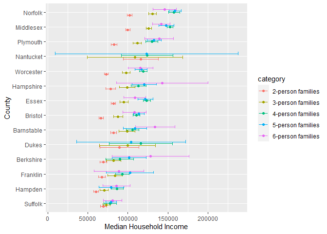
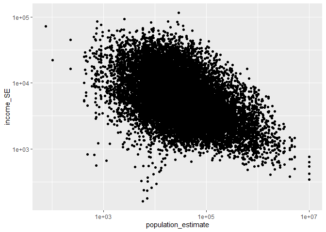
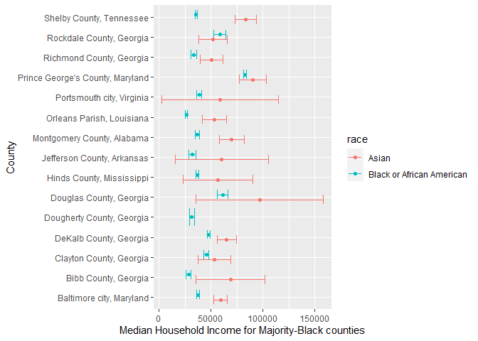

US Income
================
Olivia Chang
2023-04-10

- <a href="#grading-rubric" id="toc-grading-rubric">Grading Rubric</a>
  - <a href="#individual" id="toc-individual">Individual</a>
  - <a href="#submission" id="toc-submission">Submission</a>
- <a href="#setup" id="toc-setup">Setup</a>
  - <a
    href="#q1-load-the-population-data-from-c06-simply-replace-filename_pop-below"
    id="toc-q1-load-the-population-data-from-c06-simply-replace-filename_pop-below"><strong>q1</strong>
    Load the population data from c06; simply replace
    <code>filename_pop</code> below.</a>
  - <a href="#q2-obtain-median-income-data-from-the-census-bureau"
    id="toc-q2-obtain-median-income-data-from-the-census-bureau"><strong>q2</strong>
    Obtain median income data from the Census Bureau:</a>
  - <a
    href="#q3-tidy-the-df_income-dataset-by-completing-the-code-below-pivot-and-rename-the-columns-to-arrive-at-the-column-names-id-geographic_area_name-category-income_estimate-income_moe"
    id="toc-q3-tidy-the-df_income-dataset-by-completing-the-code-below-pivot-and-rename-the-columns-to-arrive-at-the-column-names-id-geographic_area_name-category-income_estimate-income_moe"><strong>q3</strong>
    Tidy the <code>df_income</code> dataset by completing the code below.
    Pivot and rename the columns to arrive at the column names
    <code>id, geographic_area_name, category, income_estimate, income_moe</code>.</a>
  - <a
    href="#q4-convert-the-margin-of-error-to-standard-error-additionally-compute-a-99-confidence-interval-on-income-and-normalize-the-standard-error-to-income_cv--income_se--income_estimate-provide-these-columns-with-the-names-income_se-income_lo-income_hi-income_cv"
    id="toc-q4-convert-the-margin-of-error-to-standard-error-additionally-compute-a-99-confidence-interval-on-income-and-normalize-the-standard-error-to-income_cv--income_se--income_estimate-provide-these-columns-with-the-names-income_se-income_lo-income_hi-income_cv"><strong>q4</strong>
    Convert the margin of error to standard error. Additionally, compute a
    99% confidence interval on income, and normalize the standard error to
    <code>income_CV = income_SE / income_estimate</code>. Provide these
    columns with the names
    <code>income_SE, income_lo, income_hi, income_CV</code>.</a>
  - <a href="#q5-join-df_q4-and-df_pop"
    id="toc-q5-join-df_q4-and-df_pop"><strong>q5</strong> Join
    <code>df_q4</code> and <code>df_pop</code>.</a>
- <a href="#analysis" id="toc-analysis">Analysis</a>
  - <a
    href="#q6-study-the-following-graph-making-sure-to-note-what-you-can-and-cant-conclude-based-on-the-estimates-and-confidence-intervals-document-your-observations-below-and-answer-the-questions"
    id="toc-q6-study-the-following-graph-making-sure-to-note-what-you-can-and-cant-conclude-based-on-the-estimates-and-confidence-intervals-document-your-observations-below-and-answer-the-questions"><strong>q6</strong>
    Study the following graph, making sure to note what you can <em>and
    can’t</em> conclude based on the estimates and confidence intervals.
    Document your observations below and answer the questions.</a>
  - <a
    href="#q7-plot-the-standard-error-against-population-for-all-counties-create-a-visual-that-effectively-highlights-the-trends-in-the-data-answer-the-questions-under-observations-below"
    id="toc-q7-plot-the-standard-error-against-population-for-all-counties-create-a-visual-that-effectively-highlights-the-trends-in-the-data-answer-the-questions-under-observations-below"><strong>q7</strong>
    Plot the standard error against population for all counties. Create a
    visual that effectively highlights the trends in the data. Answer the
    questions under <em>observations</em> below.</a>
- <a href="#going-further" id="toc-going-further">Going Further</a>
  - <a
    href="#q8-pose-your-own-question-about-the-data-create-a-visualization-or-table-here-and-document-your-observations"
    id="toc-q8-pose-your-own-question-about-the-data-create-a-visualization-or-table-here-and-document-your-observations"><strong>q8</strong>
    Pose your own question about the data. Create a visualization (or table)
    here, and document your observations.</a>
- <a href="#references" id="toc-references">References</a>

*Purpose*: We’ve been learning how to quantify uncertainty in estimates
through the exercises; now its time to put those skills to use studying
real data. In this challenge we’ll use concepts like confidence
intervals to help us make sense of census data.

*Reading*: - [Using ACS Estimates and Margin of
Error](https://www.census.gov/data/academy/webinars/2020/calculating-margins-of-error-acs.html)
(Optional, see the PDF on the page) - [Patterns and Causes of
Uncertainty in the American Community
Survey](https://www.sciencedirect.com/science/article/pii/S0143622813002518?casa_token=VddzQ1-spHMAAAAA:FTq92LXgiPVloJUVjnHs8Ma1HwvPigisAYtzfqaGbbRRwoknNq56Y2IzszmGgIGH4JAPzQN0)
(Optional, particularly the *Uncertainty in surveys* section under the
Introduction.)

<!-- include-rubric -->

# Grading Rubric

<!-- -------------------------------------------------- -->

Unlike exercises, **challenges will be graded**. The following rubrics
define how you will be graded, both on an individual and team basis.

## Individual

<!-- ------------------------- -->

| Category    | Needs Improvement                                                                                                | Satisfactory                                                                                                               |
|-------------|------------------------------------------------------------------------------------------------------------------|----------------------------------------------------------------------------------------------------------------------------|
| Effort      | Some task **q**’s left unattempted                                                                               | All task **q**’s attempted                                                                                                 |
| Observed    | Did not document observations, or observations incorrect                                                         | Documented correct observations based on analysis                                                                          |
| Supported   | Some observations not clearly supported by analysis                                                              | All observations clearly supported by analysis (table, graph, etc.)                                                        |
| Assessed    | Observations include claims not supported by the data, or reflect a level of certainty not warranted by the data | Observations are appropriately qualified by the quality & relevance of the data and (in)conclusiveness of the support      |
| Specified   | Uses the phrase “more data are necessary” without clarification                                                  | Any statement that “more data are necessary” specifies which *specific* data are needed to answer what *specific* question |
| Code Styled | Violations of the [style guide](https://style.tidyverse.org/) hinder readability                                 | Code sufficiently close to the [style guide](https://style.tidyverse.org/)                                                 |

## Submission

<!-- ------------------------- -->

Make sure to commit both the challenge report (`report.md` file) and
supporting files (`report_files/` folder) when you are done! Then submit
a link to Canvas. **Your Challenge submission is not complete without
all files uploaded to GitHub.**

# Setup

<!-- ----------------------------------------------------------------------- -->

``` r
library(tidyverse)
```

    ## ── Attaching packages ─────────────────────────────────────── tidyverse 1.3.2 ──
    ## ✔ ggplot2 3.4.1     ✔ purrr   1.0.1
    ## ✔ tibble  3.1.8     ✔ dplyr   1.1.0
    ## ✔ tidyr   1.3.0     ✔ stringr 1.5.0
    ## ✔ readr   2.1.4     ✔ forcats 1.0.0
    ## ── Conflicts ────────────────────────────────────────── tidyverse_conflicts() ──
    ## ✖ dplyr::filter() masks stats::filter()
    ## ✖ dplyr::lag()    masks stats::lag()

### **q1** Load the population data from c06; simply replace `filename_pop` below.

``` r
## TODO: Give the filename for your copy of Table B01003
filename_pop <- "c06-data/ACSDT5Y2018.B01003-Data.csv"

## NOTE: No need to edit
df_pop <-
  read_csv(
    filename_pop,
    skip = 1,
  ) %>% 
  rename(
    population_estimate = `Estimate!!Total`
  )
```

    ## New names:
    ## Rows: 3220 Columns: 7
    ## ── Column specification
    ## ──────────────────────────────────────────────────────── Delimiter: "," chr
    ## (5): Geography, Geographic Area Name, Annotation of Estimate!!Total, Mar... dbl
    ## (1): Estimate!!Total lgl (1): ...7
    ## ℹ Use `spec()` to retrieve the full column specification for this data. ℹ
    ## Specify the column types or set `show_col_types = FALSE` to quiet this message.
    ## • `` -> `...7`

``` r
df_pop
```

    ## # A tibble: 3,220 × 7
    ##    Geography      `Geographic Area Name`   popul…¹ Annot…² Margi…³ Annot…⁴ ...7 
    ##    <chr>          <chr>                      <dbl> <chr>   <chr>   <chr>   <lgl>
    ##  1 0500000US01001 Autauga County, Alabama    55200 null    *****   *****   NA   
    ##  2 0500000US01003 Baldwin County, Alabama   208107 null    *****   *****   NA   
    ##  3 0500000US01005 Barbour County, Alabama    25782 null    *****   *****   NA   
    ##  4 0500000US01007 Bibb County, Alabama       22527 null    *****   *****   NA   
    ##  5 0500000US01009 Blount County, Alabama     57645 null    *****   *****   NA   
    ##  6 0500000US01011 Bullock County, Alabama    10352 null    *****   *****   NA   
    ##  7 0500000US01013 Butler County, Alabama     20025 null    *****   *****   NA   
    ##  8 0500000US01015 Calhoun County, Alabama   115098 null    *****   *****   NA   
    ##  9 0500000US01017 Chambers County, Alabama   33826 null    *****   *****   NA   
    ## 10 0500000US01019 Cherokee County, Alabama   25853 null    *****   *****   NA   
    ## # … with 3,210 more rows, and abbreviated variable names ¹​population_estimate,
    ## #   ²​`Annotation of Estimate!!Total`, ³​`Margin of Error!!Total`,
    ## #   ⁴​`Annotation of Margin of Error!!Total`

You might wonder why the `Margin of Error` in the population estimates
is listed as `*****`. From the [documentation (PDF
link)](https://www.google.com/url?sa=t&rct=j&q=&esrc=s&source=web&cd=&cad=rja&uact=8&ved=2ahUKEwj81Omy16TrAhXsguAKHTzKDQEQFjABegQIBxAB&url=https%3A%2F%2Fwww2.census.gov%2Fprograms-surveys%2Facs%2Ftech_docs%2Faccuracy%2FMultiyearACSAccuracyofData2018.pdf%3F&usg=AOvVaw2TOrVuBDlkDI2gde6ugce_)
for the ACS:

> If the margin of error is displayed as ‘\*\*\*\*\*’ (five asterisks),
> the estimate has been controlled to be equal to a fixed value and so
> it has no sampling error. A standard error of zero should be used for
> these controlled estimates when completing calculations, such as those
> in the following section.

This means that for cases listed as `*****` the US Census Bureau
recommends treating the margin of error (and thus standard error) as
zero.

### **q2** Obtain median income data from the Census Bureau:

- `Filter > Topics > Income and Poverty > Income and Poverty`
- `Filter > Geography > County > All counties in United States`
- Look for `Median Income in the Past 12 Months` (Table S1903)
- Download the 2018 5-year ACS estimates; save to your `data` folder and
  add the filename below.

``` r
## TODO: Give the filename for your copy of Table S1903
filename_income <- "data/ACSST5Y2018.S1903-Data.csv"

## NOTE: No need to edit
df_income <-
  read_csv(filename_income, skip = 1)
```

    ## New names:
    ## • `` -> `...483`

    ## Warning: One or more parsing issues, call `problems()` on your data frame for details,
    ## e.g.:
    ##   dat <- vroom(...)
    ##   problems(dat)

    ## Rows: 3220 Columns: 483
    ## ── Column specification ────────────────────────────────────────────────────────
    ## Delimiter: ","
    ## chr (306): Geography, Geographic Area Name, Annotation of Margin of Error!!N...
    ## dbl (176): Estimate!!Number!!HOUSEHOLD INCOME BY RACE AND HISPANIC OR LATINO...
    ## lgl   (1): ...483
    ## 
    ## ℹ Use `spec()` to retrieve the full column specification for this data.
    ## ℹ Specify the column types or set `show_col_types = FALSE` to quiet this message.

``` r
df_income
```

    ## # A tibble: 3,220 × 483
    ##    Geography     Geogr…¹ Estim…² Margi…³ Annot…⁴ Annot…⁵ Estim…⁶ Margi…⁷ Annot…⁸
    ##    <chr>         <chr>     <dbl>   <dbl> <chr>   <chr>     <dbl>   <dbl> <chr>  
    ##  1 0500000US010… Autaug…   21115     383 null    null      16585     363 null   
    ##  2 0500000US010… Baldwi…   78622    1183 null    null      69544    1042 null   
    ##  3 0500000US010… Barbou…    9186     280 null    null       4729     211 null   
    ##  4 0500000US010… Bibb C…    6840     321 null    null       5588     346 null   
    ##  5 0500000US010… Blount…   20600     396 null    null      20054     417 null   
    ##  6 0500000US010… Bulloc…    3609     196 null    null        881     119 null   
    ##  7 0500000US010… Butler…    6708     274 null    null       3821     173 null   
    ##  8 0500000US010… Calhou…   45033     683 null    null      33820     559 null   
    ##  9 0500000US010… Chambe…   13516     372 null    null       7953     296 null   
    ## 10 0500000US010… Cherok…   10606     370 null    null       9953     356 null   
    ## # … with 3,210 more rows, 474 more variables:
    ## #   `Annotation of Estimate!!Number!!HOUSEHOLD INCOME BY RACE AND HISPANIC OR LATINO ORIGIN OF HOUSEHOLDER!!Households!!One race--!!White` <chr>,
    ## #   `Estimate!!Number!!HOUSEHOLD INCOME BY RACE AND HISPANIC OR LATINO ORIGIN OF HOUSEHOLDER!!Households!!One race--!!Black or African American` <dbl>,
    ## #   `Annotation of Estimate!!Number!!HOUSEHOLD INCOME BY RACE AND HISPANIC OR LATINO ORIGIN OF HOUSEHOLDER!!Households!!One race--!!Black or African American` <chr>,
    ## #   `Margin of Error!!Number MOE!!HOUSEHOLD INCOME BY RACE AND HISPANIC OR LATINO ORIGIN OF HOUSEHOLDER!!Households!!One race--!!Black or African American` <dbl>,
    ## #   `Annotation of Margin of Error!!Number MOE!!HOUSEHOLD INCOME BY RACE AND HISPANIC OR LATINO ORIGIN OF HOUSEHOLDER!!Households!!One race--!!Black or African American` <chr>,
    ## #   `Estimate!!Number!!HOUSEHOLD INCOME BY RACE AND HISPANIC OR LATINO ORIGIN OF HOUSEHOLDER!!Households!!One race--!!American Indian and Alaska Native` <dbl>, …

Use the following test to check that you downloaded the correct file:

``` r
## NOTE: No need to edit, use to check you got the right file.
assertthat::assert_that(
  df_income %>%
    filter(Geography == "0500000US01001") %>%
    pull(`Estimate!!Percent Distribution!!FAMILY INCOME BY FAMILY SIZE!!2-person families`)
  == 45.6
)
```

    ## [1] TRUE

``` r
print("Well done!")
```

    ## [1] "Well done!"

This dataset is in desperate need of some *tidying*. To simplify the
task, we’ll start by considering the `\\d-person families` columns
first.

### **q3** Tidy the `df_income` dataset by completing the code below. Pivot and rename the columns to arrive at the column names `id, geographic_area_name, category, income_estimate, income_moe`.

*Hint*: You can do this in a single pivot using the `".value"` argument
and a `names_pattern` using capture groups `"()"`. Remember that you can
use an OR operator `|` in a regex to allow for multiple possibilities in
a capture group, for example `"(Estimate|Margin of Error)"`.

``` r
df_q3 <-
  df_income %>%
  select(
    Geography,
    contains("Geographic"),
    # This will select only the numeric d-person family columns;
    # it will ignore the annotation columns
    contains("median") & matches("\\d-person families") & !contains("Annotation of")
  ) %>%
  mutate(across(contains("median"), as.numeric)) %>%
  pivot_longer(
    cols = !"Geography" & !"Geographic Area Name",
    names_to = c(".value", "category"),
    names_pattern = "(Estimate|Margin of Error).+([0-9].+)",
    values_drop_na = TRUE
  ) %>%
  rename(
    geographic_area_name = "Geographic Area Name",
    income_estimate = "Estimate",
    income_moe = "Margin of Error"
  ) %>%
  glimpse()
```

    ## Warning: There were 8 warnings in `mutate()`.
    ## The first warning was:
    ## ℹ In argument: `across(contains("median"), as.numeric)`.
    ## Caused by warning:
    ## ! NAs introduced by coercion
    ## ℹ Run ]8;;ide:run:dplyr::last_dplyr_warnings()dplyr::last_dplyr_warnings()]8;; to see the 7 remaining warnings.

    ## Rows: 15,286
    ## Columns: 5
    ## $ Geography            <chr> "0500000US01001", "0500000US01001", "0500000US010…
    ## $ geographic_area_name <chr> "Autauga County, Alabama", "Autauga County, Alaba…
    ## $ category             <chr> "2-person families", "3-person families", "4-pers…
    ## $ income_estimate      <dbl> 64947, 80172, 85455, 88601, 103787, 63975, 79390,…
    ## $ income_moe           <dbl> 6663, 14181, 10692, 20739, 12387, 2297, 8851, 519…

``` r
df_q3
```

    ## # A tibble: 15,286 × 5
    ##    Geography      geographic_area_name    category          income_est…¹ incom…²
    ##    <chr>          <chr>                   <chr>                    <dbl>   <dbl>
    ##  1 0500000US01001 Autauga County, Alabama 2-person families        64947    6663
    ##  2 0500000US01001 Autauga County, Alabama 3-person families        80172   14181
    ##  3 0500000US01001 Autauga County, Alabama 4-person families        85455   10692
    ##  4 0500000US01001 Autauga County, Alabama 5-person families        88601   20739
    ##  5 0500000US01001 Autauga County, Alabama 6-person families       103787   12387
    ##  6 0500000US01003 Baldwin County, Alabama 2-person families        63975    2297
    ##  7 0500000US01003 Baldwin County, Alabama 3-person families        79390    8851
    ##  8 0500000US01003 Baldwin County, Alabama 4-person families        88458    5199
    ##  9 0500000US01003 Baldwin County, Alabama 5-person families        91259    7011
    ## 10 0500000US01003 Baldwin County, Alabama 6-person families        69609   23175
    ## # … with 15,276 more rows, and abbreviated variable names ¹​income_estimate,
    ## #   ²​income_moe

Use the following tests to check your work:

``` r
## NOTE: No need to edit
assertthat::assert_that(setequal(
  names(df_q3),
  c("Geography", "geographic_area_name", "category", "income_estimate", "income_moe")
))
```

    ## [1] TRUE

``` r
assertthat::assert_that(
  df_q3 %>%
    filter(Geography == "0500000US01001", category == "2-person families") %>%
    pull(income_moe)
  == 6663
)
```

    ## [1] TRUE

``` r
print("Nice!")
```

    ## [1] "Nice!"

The data gives finite values for the Margin of Error, which is closely
related to the Standard Error. The Census Bureau documentation gives the
following relationship between Margin of Error and Standard Error:

$$\text{MOE} = 1.645 \times \text{SE}.$$

### **q4** Convert the margin of error to standard error. Additionally, compute a 99% confidence interval on income, and normalize the standard error to `income_CV = income_SE / income_estimate`. Provide these columns with the names `income_SE, income_lo, income_hi, income_CV`.

``` r
q99 <- qnorm( 1 - (1 - 0.99) / 2 )
# don't calculate mean (income_estimate) because income_estimate is already a statistic 

df_q4 <-
  df_q3 %>%
    mutate(
      income_SE = income_moe / 1.645,
      income_CV = income_SE / income_estimate,
      income_lo = income_estimate - q99 * income_SE,
      income_hi = income_estimate + q99 * income_SE
    )

df_q4
```

    ## # A tibble: 15,286 × 9
    ##    Geography     geogr…¹ categ…² incom…³ incom…⁴ incom…⁵ incom…⁶ incom…⁷ incom…⁸
    ##    <chr>         <chr>   <chr>     <dbl>   <dbl>   <dbl>   <dbl>   <dbl>   <dbl>
    ##  1 0500000US010… Autaug… 2-pers…   64947    6663   4050.  0.0624  54514.  75380.
    ##  2 0500000US010… Autaug… 3-pers…   80172   14181   8621.  0.108   57967. 102377.
    ##  3 0500000US010… Autaug… 4-pers…   85455   10692   6500.  0.0761  68713. 102197.
    ##  4 0500000US010… Autaug… 5-pers…   88601   20739  12607.  0.142   56127. 121075.
    ##  5 0500000US010… Autaug… 6-pers…  103787   12387   7530.  0.0726  84391. 123183.
    ##  6 0500000US010… Baldwi… 2-pers…   63975    2297   1396.  0.0218  60378.  67572.
    ##  7 0500000US010… Baldwi… 3-pers…   79390    8851   5381.  0.0678  65531.  93249.
    ##  8 0500000US010… Baldwi… 4-pers…   88458    5199   3160.  0.0357  80317.  96599.
    ##  9 0500000US010… Baldwi… 5-pers…   91259    7011   4262.  0.0467  80281. 102237.
    ## 10 0500000US010… Baldwi… 6-pers…   69609   23175  14088.  0.202   33320. 105898.
    ## # … with 15,276 more rows, and abbreviated variable names
    ## #   ¹​geographic_area_name, ²​category, ³​income_estimate, ⁴​income_moe,
    ## #   ⁵​income_SE, ⁶​income_CV, ⁷​income_lo, ⁸​income_hi

Use the following tests to check your work:

``` r
## NOTE: No need to edit
assertthat::assert_that(setequal(
  names(df_q4),
  c("Geography", "geographic_area_name", "category", "income_estimate", "income_moe",
    "income_SE", "income_lo", "income_hi", "income_CV")
))
```

    ## [1] TRUE

``` r
assertthat::assert_that(
  abs(
    df_q4 %>%
    filter(Geography == "0500000US01001", category == "2-person families") %>%
    pull(income_SE) - 4050.456
  ) / 4050.456 < 1e-3
)
```

    ## [1] TRUE

``` r
assertthat::assert_that(
  abs(
    df_q4 %>%
    filter(Geography == "0500000US01001", category == "2-person families") %>%
    pull(income_lo) - 54513.72
  ) / 54513.72 < 1e-3
)
```

    ## [1] TRUE

``` r
assertthat::assert_that(
  abs(
    df_q4 %>%
    filter(Geography == "0500000US01001", category == "2-person families") %>%
    pull(income_hi) - 75380.28
  ) / 75380.28 < 1e-3
)
```

    ## [1] TRUE

``` r
assertthat::assert_that(
  abs(
    df_q4 %>%
    filter(Geography == "0500000US01001", category == "2-person families") %>%
    pull(income_CV) - 0.06236556
  ) / 0.06236556 < 1e-3
)
```

    ## [1] TRUE

``` r
print("Nice!")
```

    ## [1] "Nice!"

One last wrangling step: We need to join the two datasets so we can
compare population with income.

### **q5** Join `df_q4` and `df_pop`.

``` r
## TODO: Join df_q4 and df_pop by the appropriate column

df_data <-
  df_q4 %>%
    left_join(df_pop, by = "Geography")

df_data
```

    ## # A tibble: 15,286 × 15
    ##    Geography     geogr…¹ categ…² incom…³ incom…⁴ incom…⁵ incom…⁶ incom…⁷ incom…⁸
    ##    <chr>         <chr>   <chr>     <dbl>   <dbl>   <dbl>   <dbl>   <dbl>   <dbl>
    ##  1 0500000US010… Autaug… 2-pers…   64947    6663   4050.  0.0624  54514.  75380.
    ##  2 0500000US010… Autaug… 3-pers…   80172   14181   8621.  0.108   57967. 102377.
    ##  3 0500000US010… Autaug… 4-pers…   85455   10692   6500.  0.0761  68713. 102197.
    ##  4 0500000US010… Autaug… 5-pers…   88601   20739  12607.  0.142   56127. 121075.
    ##  5 0500000US010… Autaug… 6-pers…  103787   12387   7530.  0.0726  84391. 123183.
    ##  6 0500000US010… Baldwi… 2-pers…   63975    2297   1396.  0.0218  60378.  67572.
    ##  7 0500000US010… Baldwi… 3-pers…   79390    8851   5381.  0.0678  65531.  93249.
    ##  8 0500000US010… Baldwi… 4-pers…   88458    5199   3160.  0.0357  80317.  96599.
    ##  9 0500000US010… Baldwi… 5-pers…   91259    7011   4262.  0.0467  80281. 102237.
    ## 10 0500000US010… Baldwi… 6-pers…   69609   23175  14088.  0.202   33320. 105898.
    ## # … with 15,276 more rows, 6 more variables: `Geographic Area Name` <chr>,
    ## #   population_estimate <dbl>, `Annotation of Estimate!!Total` <chr>,
    ## #   `Margin of Error!!Total` <chr>,
    ## #   `Annotation of Margin of Error!!Total` <chr>, ...7 <lgl>, and abbreviated
    ## #   variable names ¹​geographic_area_name, ²​category, ³​income_estimate,
    ## #   ⁴​income_moe, ⁵​income_SE, ⁶​income_CV, ⁷​income_lo, ⁸​income_hi

# Analysis

<!-- ----------------------------------------------------------------------- -->

We now have both estimates and confidence intervals for
`\\d-person families`. Now we can compare cases with quantified
uncertainties: Let’s practice!

### **q6** Study the following graph, making sure to note what you can *and can’t* conclude based on the estimates and confidence intervals. Document your observations below and answer the questions.

``` r
## NOTE: No need to edit; run and inspect
wid <- 0.5

df_data %>%
  filter(str_detect(geographic_area_name, "Massachusetts")) %>%
  mutate(
    county = str_remove(geographic_area_name, " County,.*$"),
    county = fct_reorder(county, income_estimate)
  ) %>%

  ggplot(aes(county, income_estimate, color = category)) +
  geom_errorbar(
    aes(ymin = income_lo, ymax = income_hi),
    position = position_dodge(width = wid)
  ) +
  geom_point(position = position_dodge(width = wid)) +

  coord_flip() +
  labs(
    x = "County",
    y = "Median Household Income"
  )
```

<!-- -->

**Observations**:

- Document your observations here.
  - In general, the larger the family, the greater the median household
    income.
  - The confidence intervals tend to overlap more as family size
    increases, suggesting that additional household members does not
    necessarily correspond to greater median incomes.
  - The median household income in Suffolk County, which includes the
    only major metropolitan area in Massachusetts (Boston) is lower for
    2 person families than more suburban counties like Norfolk County.
    However, this is just an observation and we can’t make
    generalizations based on this data alone about incomes for suburban
    vs. urban areas.
  - In general, the confidence intervals tend to be wider for larger
    families, showing that there is a greater range of potential incomes
    for wider families.
- Can you confidently distinguish between household incomes in Suffolk
  county? Why or why not?
  - No, we can’t confidently distinguish between household incomes in
    Suffolk county because the confidence intervals by category overlap
    with each other.
- Which counties have the widest confidence intervals?
  - Nantucket, Hampshire, Dukes, and Berkshire have the widest
    confidence intervals of the counties in Massachusetts.

In the next task you’ll investigate the relationship between population
and uncertainty.

### **q7** Plot the standard error against population for all counties. Create a visual that effectively highlights the trends in the data. Answer the questions under *observations* below.

*Hint*: Remember that standard error is a function of *both* variability
(e.g. variance) and sample size.

``` r
df_data %>%
  ggplot(mapping = aes(x = population_estimate, y = income_SE)) +
    geom_point() +
    scale_x_continuous(trans='log10') +
    scale_y_continuous(trans='log10')
```

<!-- -->

**Observations**:

- What *overall* trend do you see between `SE` and population? Why might
  this trend exist?
  - In general, higher population means higher standard error. Since
    standard error is also a function of sample size, we would expect
    standard error to decrease as sample size increases. Counties with
    larger populations should have more data points (i.e. a greater
    sample size), and therefore a smaller standard error than counties
    with smaller populations.
- What does this *overall* trend tell you about the relative ease of
  studying small vs large counties?
  - Since large counties have more data points, the standard error for
    large counties should generally be smaller, making it easier to make
    more confident observations and draw conclusions.

# Going Further

<!-- ----------------------------------------------------------------------- -->

Now it’s your turn! You have income data for every county in the United
States: Pose your own question and try to answer it with the data.

### **q8** Pose your own question about the data. Create a visualization (or table) here, and document your observations.

``` r
# redo data pivoting and selecting to get incomes by race

df_q8 <-
  df_income %>%
  select(
    Geography,
    contains("Geographic"),
    # This will select only the numeric d-person family columns;
    # it will ignore the annotation columns
    contains("median") & matches("\\One race--!!") & !contains("Annotation of")
  ) %>%
  mutate(across(contains("median"), as.numeric)) %>%
  pivot_longer(
    cols = !"Geography" & !"Geographic Area Name",
    names_to = c(".value", "race"),
    names_pattern = "(Estimate|Margin of Error).+One race--!!(.+)",
    values_drop_na = TRUE
  ) %>%
  rename(
    geographic_area_name = "Geographic Area Name",
    income_estimate = "Estimate",
    income_moe = "Margin of Error"
  ) %>%
  mutate(
      income_SE = income_moe / 1.645,
      income_CV = income_SE / income_estimate,
      income_lo = income_estimate - q99 * income_SE,
      income_hi = income_estimate + q99 * income_SE
    ) %>%
  drop_na()
```

    ## Warning: There were 10 warnings in `mutate()`.
    ## The first warning was:
    ## ℹ In argument: `across(contains("median"), as.numeric)`.
    ## Caused by warning:
    ## ! NAs introduced by coercion
    ## ℹ Run ]8;;ide:run:dplyr::last_dplyr_warnings()dplyr::last_dplyr_warnings()]8;; to see the 9 remaining warnings.

``` r
df_q8
```

    ## # A tibble: 9,955 × 9
    ##    Geography      geogra…¹ race  incom…² incom…³ incom…⁴ incom…⁵ incom…⁶ incom…⁷
    ##    <chr>          <chr>    <chr>   <dbl>   <dbl>   <dbl>   <dbl>   <dbl>   <dbl>
    ##  1 0500000US01001 Autauga… White   66423    4761   2894.  0.0436  58968.  73878.
    ##  2 0500000US01001 Autauga… Blac…   27643    2692   1636.  0.0592  23428.  31858.
    ##  3 0500000US01003 Baldwin… White   58931    1138    692.  0.0117  57149.  60713.
    ##  4 0500000US01003 Baldwin… Blac…   31112    4951   3010.  0.0967  23359.  38865.
    ##  5 0500000US01003 Baldwin… Amer…   53289    8005   4866.  0.0913  40754.  65824.
    ##  6 0500000US01003 Baldwin… Asian   34763   14953   9090.  0.261   11349.  58177.
    ##  7 0500000US01003 Baldwin… Some…   45634   37471  22779.  0.499  -13040. 104308.
    ##  8 0500000US01005 Barbour… White   46719    4210   2559.  0.0548  40127.  53311.
    ##  9 0500000US01005 Barbour… Blac…   23013    2168   1318.  0.0573  19618.  26408.
    ## 10 0500000US01005 Barbour… Asian   50417   39263  23868.  0.473  -11063. 111897.
    ## # … with 9,945 more rows, and abbreviated variable names ¹​geographic_area_name,
    ## #   ²​income_estimate, ³​income_moe, ⁴​income_SE, ⁵​income_CV, ⁶​income_lo,
    ## #   ⁷​income_hi

``` r
# From race dataset get % black to filter for majority black counties
# Load Race dataset for 2021
df_race <- read_csv("c06-data/ACSDT1y2021.B02001-Data.csv", skip = 1, col_select = c("Geography", "Geographic Area Name", "Estimate!!Total:", "Estimate!!Total:!!Black or African American alone", "Estimate!!Total:!!Asian alone")) %>%
  select(c(
    "Geography", 
    "Geographic Area Name",
    population = "Estimate!!Total:",
    population_asian = "Estimate!!Total:!!Asian alone",
    population_black = "Estimate!!Total:!!Black or African American alone")) %>%
  mutate_at(c('population','population_black', 'population_asian'), as.numeric)  %>%
  mutate(pct_black = population_black/population, pct_asian = population_asian/population) %>%
  rename(
    geographic_area_name = "Geographic Area Name"
  )
```

    ## New names:
    ## Rows: 841 Columns: 5
    ## ── Column specification
    ## ──────────────────────────────────────────────────────── Delimiter: "," chr
    ## (5): Geography, Geographic Area Name, Estimate!!Total:, Estimate!!Total:...
    ## ℹ Use `spec()` to retrieve the full column specification for this data. ℹ
    ## Specify the column types or set `show_col_types = FALSE` to quiet this message.
    ## • `` -> `...43`

    ## Warning: There were 3 warnings in `mutate()`.
    ## The first warning was:
    ## ℹ In argument: `population = .Primitive("as.double")(population)`.
    ## Caused by warning:
    ## ! NAs introduced by coercion
    ## ℹ Run ]8;;ide:run:dplyr::last_dplyr_warnings()dplyr::last_dplyr_warnings()]8;; to see the 2 remaining warnings.

``` r
df_q8_2 <-
  df_q8 %>%
  left_join(df_race, by = "geographic_area_name") %>%
  select(geographic_area_name, income_estimate, income_lo, income_hi, race, pct_black) %>%
  drop_na()

df_q8_2
```

    ## # A tibble: 4,027 × 6
    ##    geographic_area_name    income_estimate income_lo income_hi race      pct_b…¹
    ##    <chr>                             <dbl>     <dbl>     <dbl> <chr>       <dbl>
    ##  1 Baldwin County, Alabama           58931    57149.    60713. White      0.0890
    ##  2 Baldwin County, Alabama           31112    23359.    38865. Black or…  0.0890
    ##  3 Baldwin County, Alabama           53289    40754.    65824. American…  0.0890
    ##  4 Baldwin County, Alabama           34763    11349.    58177. Asian      0.0890
    ##  5 Baldwin County, Alabama           45634   -13040.   104308. Some oth…  0.0890
    ##  6 Calhoun County, Alabama           51223    47891.    54555. White      0.194 
    ##  7 Calhoun County, Alabama           28478    22716.    34240. Black or…  0.194 
    ##  8 Calhoun County, Alabama           51333    11753.    90913. American…  0.194 
    ##  9 Calhoun County, Alabama           38750    18325.    59175. Asian      0.194 
    ## 10 Calhoun County, Alabama           43942    25800.    62084. Some oth…  0.194 
    ## # … with 4,017 more rows, and abbreviated variable name ¹​pct_black

``` r
df_q8_2 %>%
  filter(pct_black > 0.5, race == "Asian" | race == "Black or African American") %>%
  ggplot(aes(geographic_area_name, income_estimate, color = race)) +
  geom_errorbar(
    aes(ymin = income_lo, ymax = income_hi),
    position = position_dodge(width = wid)
  ) +
  geom_point(position = position_dodge(width = wid)) +
  coord_flip() +
  labs(
    x = "County",
    y = "Median Household Income for Majority-Black counties"
  )
```

<!-- -->

**Observations**:

Question: In majority black counties, how does median income of Asian
households compare with Black or African American households?

Context: In my Race in American Politics class last year at Wellesley,
we read *Bitter Fruit: The Politics of Black-Korean Conflict in New York
City* by Claire Jean Kim. Kim establishes the framework of racial
triangulation, where Asians are “weaponized” by white people against
other minorities - particularly Black people - in order to depress
solidarity amongst people of color that could threaten white dominance.
Valorization of Asians relative to Blacks allows whites to claim that
assumed “cultural values”, not discrimination and immigration laws
selecting for wealthier Asians, are why Asians (particularly East
Asians) have in general achieved economic success. As Kim explains,
residential segregation has left Black people without the resources to
take advantage of private-sector niches opened by white flight. On the
other hand, the Hart-Celler Act precipitated the immigration of
educated, middle-class Asians with the necessary capital for retail
store ownership. These immigrants largely found success by opening
stores—but not living in—Black neighborhoods. In the Black nationalist
frame of community control, not only have Black people been closed off
from small-business ownership in their own neighborhoods, but money
spent by Black customers in these stores leave the community (i.e. are
going to Asian households). *Bitter Fruit* documents and analyzes the
conflicts that often result from this juxtaposition. After reading
*Bitter Fruit*, I was interested in comparing the median household
incomes for Asian and Black households in majority black counties to
provide additional data to the community control framework.

- The confidence interval for Asian household incomes in majority black
  counties is in general wider than Black households.
- The Asian household income *estimate* is greater than the median Black
  household income in every majority black county.
- For several counties the confidence interval for Asian household
  income encompasses the confidence interval for Black household income,
  so we cannot confidently conclude that the household income for Asian
  households is greater than that of Black households for counties such
  as Jefferson and Portsmouth City, Virginia, but we can for Shelby
  countyand Dekalb county.

# References

<!-- ----------------------------------------------------------------------- -->

\[1\] Spielman SE, Folch DC, Nagle NN (2014) Patterns and causes of
uncertainty in the American Community Survey. Applied Geography 46:
147–157. <pmid:25404783>
[link](https://www.sciencedirect.com/science/article/pii/S0143622813002518?casa_token=VddzQ1-spHMAAAAA:FTq92LXgiPVloJUVjnHs8Ma1HwvPigisAYtzfqaGbbRRwoknNqZ6Y2IzszmGgIGH4JAPzQN0)
