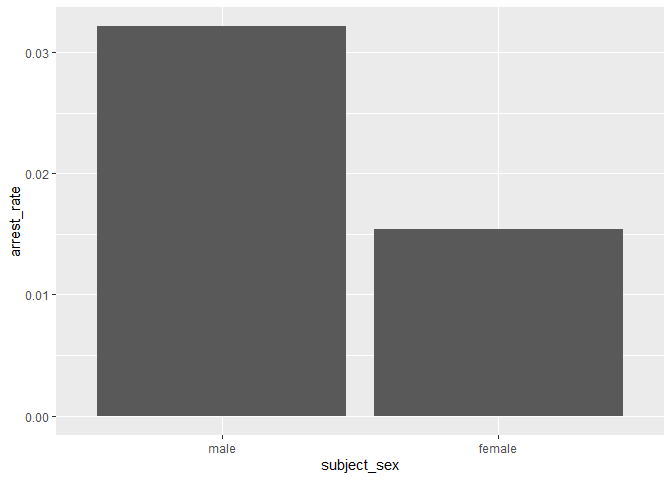
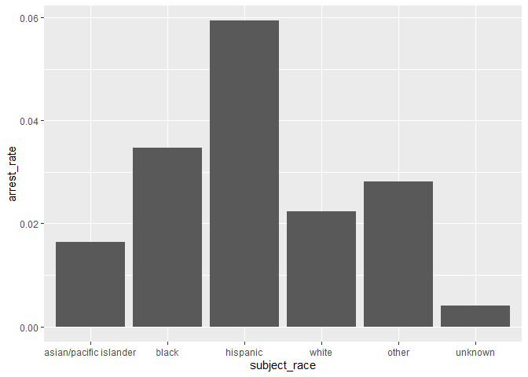
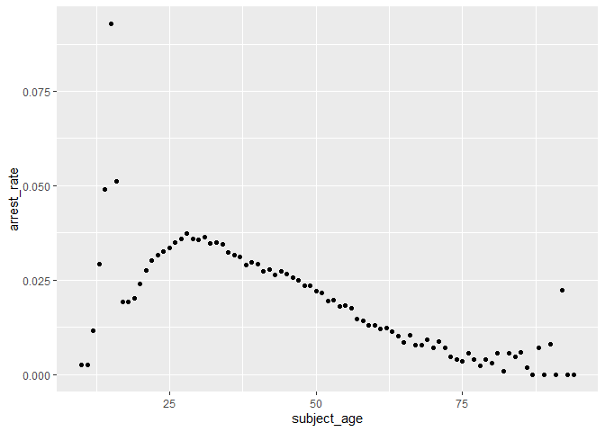
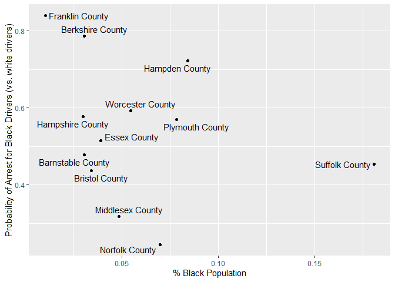

Massachusetts Highway Stops
================
Olivia Chang
2023-04-28

- <a href="#grading-rubric" id="toc-grading-rubric">Grading Rubric</a>
  - <a href="#individual" id="toc-individual">Individual</a>
  - <a href="#due-date" id="toc-due-date">Due Date</a>
- <a href="#setup" id="toc-setup">Setup</a>
  - <a
    href="#q1-go-to-the-stanford-open-policing-project-page-and-download-the-massachusetts-state-police-records-in-rds-format-move-the-data-to-your-data-folder-and-match-the-filename-to-load-the-data"
    id="toc-q1-go-to-the-stanford-open-policing-project-page-and-download-the-massachusetts-state-police-records-in-rds-format-move-the-data-to-your-data-folder-and-match-the-filename-to-load-the-data"><strong>q1</strong>
    Go to the Stanford Open Policing Project page and download the
    Massachusetts State Police records in <code>Rds</code> format. Move the
    data to your <code>data</code> folder and match the
    <code>filename</code> to load the data.</a>
- <a href="#eda" id="toc-eda">EDA</a>
  - <a
    href="#q2-do-your-first-checks-on-the-dataset-what-are-the-basic-facts-about-this-dataset"
    id="toc-q2-do-your-first-checks-on-the-dataset-what-are-the-basic-facts-about-this-dataset"><strong>q2</strong>
    Do your “first checks” on the dataset. What are the basic facts about
    this dataset?</a>
  - <a
    href="#q3-check-the-set-of-factor-levels-for-subject_race-and-raw_race-what-do-you-note-about-overlap--difference-between-the-two-sets"
    id="toc-q3-check-the-set-of-factor-levels-for-subject_race-and-raw_race-what-do-you-note-about-overlap--difference-between-the-two-sets"><strong>q3</strong>
    Check the set of factor levels for <code>subject_race</code> and
    <code>raw_Race</code>. What do you note about overlap / difference
    between the two sets?</a>
  - <a
    href="#q4-check-whether-subject_race-and-raw_race-match-for-a-large-fraction-of-cases-which-of-the-two-hypotheses-above-is-most-likely-based-on-your-results"
    id="toc-q4-check-whether-subject_race-and-raw_race-match-for-a-large-fraction-of-cases-which-of-the-two-hypotheses-above-is-most-likely-based-on-your-results"><strong>q4</strong>
    Check whether <code>subject_race</code> and <code>raw_Race</code> match
    for a large fraction of cases. Which of the two hypotheses above is most
    likely, based on your results?</a>
  - <a href="#vis" id="toc-vis">Vis</a>
    - <a
      href="#q5-compare-the-arrest-ratethe-fraction-of-total-cases-in-which-the-subject-was-arrestedacross-different-factors-create-as-many-visuals-or-tables-as-you-need-but-make-sure-to-check-the-trends-across-all-of-the-subject-variables-answer-the-questions-under-observations-below"
      id="toc-q5-compare-the-arrest-ratethe-fraction-of-total-cases-in-which-the-subject-was-arrestedacross-different-factors-create-as-many-visuals-or-tables-as-you-need-but-make-sure-to-check-the-trends-across-all-of-the-subject-variables-answer-the-questions-under-observations-below"><strong>q5</strong>
      Compare the <em>arrest rate</em>—the fraction of total cases in which
      the subject was arrested—across different factors. Create as many
      visuals (or tables) as you need, but make sure to check the trends
      across all of the <code>subject</code> variables. Answer the questions
      under <em>observations</em> below.</a>
- <a href="#modeling" id="toc-modeling">Modeling</a>
  - <a
    href="#q6-run-the-following-code-and-interpret-the-regression-coefficients-answer-the-the-questions-under-observations-below"
    id="toc-q6-run-the-following-code-and-interpret-the-regression-coefficients-answer-the-the-questions-under-observations-below"><strong>q6</strong>
    Run the following code and interpret the regression coefficients. Answer
    the the questions under <em>observations</em> below.</a>
  - <a
    href="#q7-re-fit-the-logistic-regression-from-q6-setting-white-as-the-reference-level-for-subject_race-interpret-the-the-model-terms-and-answer-the-questions-below"
    id="toc-q7-re-fit-the-logistic-regression-from-q6-setting-white-as-the-reference-level-for-subject_race-interpret-the-the-model-terms-and-answer-the-questions-below"><strong>q7</strong>
    Re-fit the logistic regression from q6 setting <code>"white"</code> as
    the reference level for <code>subject_race</code>. Interpret the the
    model terms and answer the questions below.</a>
  - <a
    href="#q8-re-fit-the-model-using-a-factor-indicating-the-presence-of-contraband-in-the-subjects-vehicle-answer-the-questions-under-observations-below"
    id="toc-q8-re-fit-the-model-using-a-factor-indicating-the-presence-of-contraband-in-the-subjects-vehicle-answer-the-questions-under-observations-below"><strong>q8</strong>
    Re-fit the model using a factor indicating the presence of contraband in
    the subject’s vehicle. Answer the questions under <em>observations</em>
    below.</a>
  - <a
    href="#q9-go-deeper-pose-at-least-one-more-question-about-the-data-and-fit-at-least-one-more-model-in-support-of-answering-that-question"
    id="toc-q9-go-deeper-pose-at-least-one-more-question-about-the-data-and-fit-at-least-one-more-model-in-support-of-answering-that-question"><strong>q9</strong>
    Go deeper: Pose at least one more question about the data and fit at
    least one more model in support of answering that question.</a>
  - <a href="#further-reading" id="toc-further-reading">Further Reading</a>

*Purpose*: In this last challenge we’ll focus on using logistic
regression to study a large, complicated dataset. Interpreting the
results of a model can be challenging—both in terms of the statistics
and the real-world reasoning—so we’ll get some practice in this
challenge.

<!-- include-rubric -->

# Grading Rubric

<!-- -------------------------------------------------- -->

Unlike exercises, **challenges will be graded**. The following rubrics
define how you will be graded, both on an individual and team basis.

## Individual

<!-- ------------------------- -->

| Category    | Needs Improvement                                                                                                | Satisfactory                                                                                                               |
|-------------|------------------------------------------------------------------------------------------------------------------|----------------------------------------------------------------------------------------------------------------------------|
| Effort      | Some task **q**’s left unattempted                                                                               | All task **q**’s attempted                                                                                                 |
| Observed    | Did not document observations, or observations incorrect                                                         | Documented correct observations based on analysis                                                                          |
| Supported   | Some observations not clearly supported by analysis                                                              | All observations clearly supported by analysis (table, graph, etc.)                                                        |
| Assessed    | Observations include claims not supported by the data, or reflect a level of certainty not warranted by the data | Observations are appropriately qualified by the quality & relevance of the data and (in)conclusiveness of the support      |
| Specified   | Uses the phrase “more data are necessary” without clarification                                                  | Any statement that “more data are necessary” specifies which *specific* data are needed to answer what *specific* question |
| Code Styled | Violations of the [style guide](https://style.tidyverse.org/) hinder readability                                 | Code sufficiently close to the [style guide](https://style.tidyverse.org/)                                                 |

## Due Date

<!-- ------------------------- -->

All the deliverables stated in the rubrics above are due **at midnight**
before the day of the class discussion of the challenge. See the
[Syllabus](https://docs.google.com/document/d/1qeP6DUS8Djq_A0HMllMqsSqX3a9dbcx1/edit?usp=sharing&ouid=110386251748498665069&rtpof=true&sd=true)
for more information.

*Background*: We’ll study data from the [Stanford Open Policing
Project](https://openpolicing.stanford.edu/data/), specifically their
dataset on Massachusetts State Patrol police stops.

``` r
library(tidyverse)
```

    ## ── Attaching packages ─────────────────────────────────────── tidyverse 1.3.2 ──
    ## ✔ ggplot2 3.4.1     ✔ purrr   1.0.1
    ## ✔ tibble  3.1.8     ✔ dplyr   1.1.0
    ## ✔ tidyr   1.3.0     ✔ stringr 1.5.0
    ## ✔ readr   2.1.4     ✔ forcats 1.0.0
    ## ── Conflicts ────────────────────────────────────────── tidyverse_conflicts() ──
    ## ✖ dplyr::filter() masks stats::filter()
    ## ✖ dplyr::lag()    masks stats::lag()

``` r
library(broom)
```

# Setup

<!-- -------------------------------------------------- -->

### **q1** Go to the [Stanford Open Policing Project](https://openpolicing.stanford.edu/data/) page and download the Massachusetts State Police records in `Rds` format. Move the data to your `data` folder and match the `filename` to load the data.

*Note*: An `Rds` file is an R-specific file format. The function
`readRDS` will read these files.

``` r
## TODO: Download the data, move to your data folder, and load it
filename <- "data/yg821jf8611_ma_statewide_2020_04_01.rds"
df_data <- readRDS(filename)
df_data
```

    ## # A tibble: 3,416,238 × 24
    ##    raw_row_nu…¹ date       locat…² count…³ subje…⁴ subje…⁵ subje…⁶ type  arres…⁷
    ##    <chr>        <date>     <chr>   <chr>     <int> <fct>   <fct>   <fct> <lgl>  
    ##  1 1            2007-06-06 MIDDLE… Plymou…      33 white   male    vehi… FALSE  
    ##  2 2            2007-06-07 SEEKONK Bristo…      36 white   male    vehi… FALSE  
    ##  3 3            2007-06-07 MEDFORD Middle…      56 white   female  vehi… FALSE  
    ##  4 4            2007-06-07 MEDFORD Middle…      37 white   male    vehi… FALSE  
    ##  5 5            2007-06-07 EVERETT Middle…      22 hispan… female  vehi… FALSE  
    ##  6 6            2007-06-07 MEDFORD Middle…      34 white   male    vehi… FALSE  
    ##  7 7            2007-06-07 SOMERV… Middle…      54 hispan… male    vehi… FALSE  
    ##  8 8            2007-06-07 HOPKIN… Middle…      31 hispan… female  vehi… FALSE  
    ##  9 9            2007-06-07 SOMERV… Middle…      21 white   male    vehi… FALSE  
    ## 10 10           2007-06-06 BARNST… Barnst…      56 white   male    vehi… FALSE  
    ## # … with 3,416,228 more rows, 15 more variables: citation_issued <lgl>,
    ## #   warning_issued <lgl>, outcome <fct>, contraband_found <lgl>,
    ## #   contraband_drugs <lgl>, contraband_weapons <lgl>, contraband_alcohol <lgl>,
    ## #   contraband_other <lgl>, frisk_performed <lgl>, search_conducted <lgl>,
    ## #   search_basis <fct>, reason_for_stop <chr>, vehicle_type <chr>,
    ## #   vehicle_registration_state <fct>, raw_Race <chr>, and abbreviated variable
    ## #   names ¹​raw_row_number, ²​location, ³​county_name, ⁴​subject_age, …

# EDA

<!-- -------------------------------------------------- -->

### **q2** Do your “first checks” on the dataset. What are the basic facts about this dataset?

``` r
df_data
```

    ## # A tibble: 3,416,238 × 24
    ##    raw_row_nu…¹ date       locat…² count…³ subje…⁴ subje…⁵ subje…⁶ type  arres…⁷
    ##    <chr>        <date>     <chr>   <chr>     <int> <fct>   <fct>   <fct> <lgl>  
    ##  1 1            2007-06-06 MIDDLE… Plymou…      33 white   male    vehi… FALSE  
    ##  2 2            2007-06-07 SEEKONK Bristo…      36 white   male    vehi… FALSE  
    ##  3 3            2007-06-07 MEDFORD Middle…      56 white   female  vehi… FALSE  
    ##  4 4            2007-06-07 MEDFORD Middle…      37 white   male    vehi… FALSE  
    ##  5 5            2007-06-07 EVERETT Middle…      22 hispan… female  vehi… FALSE  
    ##  6 6            2007-06-07 MEDFORD Middle…      34 white   male    vehi… FALSE  
    ##  7 7            2007-06-07 SOMERV… Middle…      54 hispan… male    vehi… FALSE  
    ##  8 8            2007-06-07 HOPKIN… Middle…      31 hispan… female  vehi… FALSE  
    ##  9 9            2007-06-07 SOMERV… Middle…      21 white   male    vehi… FALSE  
    ## 10 10           2007-06-06 BARNST… Barnst…      56 white   male    vehi… FALSE  
    ## # … with 3,416,228 more rows, 15 more variables: citation_issued <lgl>,
    ## #   warning_issued <lgl>, outcome <fct>, contraband_found <lgl>,
    ## #   contraband_drugs <lgl>, contraband_weapons <lgl>, contraband_alcohol <lgl>,
    ## #   contraband_other <lgl>, frisk_performed <lgl>, search_conducted <lgl>,
    ## #   search_basis <fct>, reason_for_stop <chr>, vehicle_type <chr>,
    ## #   vehicle_registration_state <fct>, raw_Race <chr>, and abbreviated variable
    ## #   names ¹​raw_row_number, ²​location, ³​county_name, ⁴​subject_age, …

``` r
df_data %>% summary()
```

    ##  raw_row_number          date              location         county_name       
    ##  Length:3416238     Min.   :2007-01-01   Length:3416238     Length:3416238    
    ##  Class :character   1st Qu.:2009-04-22   Class :character   Class :character  
    ##  Mode  :character   Median :2011-07-08   Mode  :character   Mode  :character  
    ##                     Mean   :2011-07-16                                        
    ##                     3rd Qu.:2013-08-27                                        
    ##                     Max.   :2015-12-31                                        
    ##                                                                               
    ##   subject_age                     subject_race     subject_sex     
    ##  Min.   :10.00    asian/pacific islander: 166842   male  :2362238  
    ##  1st Qu.:25.00    black                 : 351610   female:1038377  
    ##  Median :34.00    hispanic              : 338317   NA's  :  15623  
    ##  Mean   :36.47    white                 :2529780                   
    ##  3rd Qu.:46.00    other                 :  11008                   
    ##  Max.   :94.00    unknown               :  17017                   
    ##  NA's   :158006   NA's                  :   1664                   
    ##          type         arrest_made     citation_issued warning_issued 
    ##  pedestrian:      0   Mode :logical   Mode :logical   Mode :logical  
    ##  vehicular :3416238   FALSE:3323303   FALSE:1244039   FALSE:2269244  
    ##                       TRUE :92019     TRUE :2171283   TRUE :1146078  
    ##                       NA's :916       NA's :916       NA's :916      
    ##                                                                      
    ##                                                                      
    ##                                                                      
    ##      outcome        contraband_found contraband_drugs contraband_weapons
    ##  warning :1146078   Mode :logical    Mode :logical    Mode :logical     
    ##  citation:2171283   FALSE:28256      FALSE:36296      FALSE:53237       
    ##  summons :      0   TRUE :27474      TRUE :19434      TRUE :2493        
    ##  arrest  :  92019   NA's :3360508    NA's :3360508    NA's :3360508     
    ##  NA's    :   6858                                                       
    ##                                                                         
    ##                                                                         
    ##  contraband_alcohol contraband_other frisk_performed search_conducted
    ##  Mode :logical      Mode :logical    Mode :logical   Mode :logical   
    ##  FALSE:3400070      FALSE:51708      FALSE:51029     FALSE:3360508   
    ##  TRUE :16168        TRUE :4022       TRUE :3602      TRUE :55730     
    ##                     NA's :3360508    NA's :3361607                   
    ##                                                                      
    ##                                                                      
    ##                                                                      
    ##          search_basis     reason_for_stop    vehicle_type      
    ##  k9            :      0   Length:3416238     Length:3416238    
    ##  plain view    :      0   Class :character   Class :character  
    ##  consent       :   6903   Mode  :character   Mode  :character  
    ##  probable cause:  25898                                        
    ##  other         :  18228                                        
    ##  NA's          :3365209                                        
    ##                                                                
    ##  vehicle_registration_state   raw_Race        
    ##  MA     :3053713            Length:3416238    
    ##  CT     :  82906            Class :character  
    ##  NY     :  69059            Mode  :character  
    ##  NH     :  51514                              
    ##  RI     :  39375                              
    ##  (Other): 109857                              
    ##  NA's   :   9814

``` r
df_data %>% glimpse()
```

    ## Rows: 3,416,238
    ## Columns: 24
    ## $ raw_row_number             <chr> "1", "2", "3", "4", "5", "6", "7", "8", "9"…
    ## $ date                       <date> 2007-06-06, 2007-06-07, 2007-06-07, 2007-0…
    ## $ location                   <chr> "MIDDLEBOROUGH", "SEEKONK", "MEDFORD", "MED…
    ## $ county_name                <chr> "Plymouth County", "Bristol County", "Middl…
    ## $ subject_age                <int> 33, 36, 56, 37, 22, 34, 54, 31, 21, 56, 56,…
    ## $ subject_race               <fct> white, white, white, white, hispanic, white…
    ## $ subject_sex                <fct> male, male, female, male, female, male, mal…
    ## $ type                       <fct> vehicular, vehicular, vehicular, vehicular,…
    ## $ arrest_made                <lgl> FALSE, FALSE, FALSE, FALSE, FALSE, FALSE, F…
    ## $ citation_issued            <lgl> TRUE, FALSE, FALSE, FALSE, TRUE, TRUE, TRUE…
    ## $ warning_issued             <lgl> FALSE, TRUE, TRUE, TRUE, FALSE, FALSE, FALS…
    ## $ outcome                    <fct> citation, warning, warning, warning, citati…
    ## $ contraband_found           <lgl> NA, FALSE, NA, NA, NA, NA, NA, NA, NA, NA, …
    ## $ contraband_drugs           <lgl> NA, FALSE, NA, NA, NA, NA, NA, NA, NA, NA, …
    ## $ contraband_weapons         <lgl> NA, FALSE, NA, NA, NA, NA, NA, NA, NA, NA, …
    ## $ contraband_alcohol         <lgl> FALSE, FALSE, FALSE, FALSE, FALSE, FALSE, F…
    ## $ contraband_other           <lgl> NA, FALSE, NA, NA, NA, NA, NA, NA, NA, NA, …
    ## $ frisk_performed            <lgl> NA, FALSE, NA, NA, NA, NA, NA, NA, NA, NA, …
    ## $ search_conducted           <lgl> FALSE, TRUE, FALSE, FALSE, FALSE, FALSE, FA…
    ## $ search_basis               <fct> NA, other, NA, NA, NA, NA, NA, NA, NA, NA, …
    ## $ reason_for_stop            <chr> "Speed", NA, NA, NA, NA, "Speed", NA, NA, N…
    ## $ vehicle_type               <chr> "Passenger", "Commercial", "Passenger", "Co…
    ## $ vehicle_registration_state <fct> MA, MA, MA, MA, MA, MA, MA, MA, MA, MA, MA,…
    ## $ raw_Race                   <chr> "White", "White", "White", "White", "Hispan…

The dataset contains all traffic stops in Massachusetts from December
2006 to December 2015. It contains the stop date and location, as well
as the race, sex, and age of the driver, whether a search was conducted
(`search_conducted`) and why (`search_basis`), whether contrabound was
found, the type of vehicle being driven and the license plate, whether a
warning was issued, whether an arrest was made, etc.

Note that we have both a `subject_race` and `race_Raw` column. There are
a few possibilities as to what `race_Raw` represents:

- `race_Raw` could be the race of the police officer in the stop
- `race_Raw` could be an unprocessed version of `subject_race`

Let’s try to distinguish between these two possibilities.

### **q3** Check the set of factor levels for `subject_race` and `raw_Race`. What do you note about overlap / difference between the two sets?

``` r
## TODO: Determine the factor levels for subject_race and raw_Race

# subject_race
df_data %>%
  pull(subject_race) %>%
  levels()
```

    ## [1] "asian/pacific islander" "black"                  "hispanic"              
    ## [4] "white"                  "other"                  "unknown"

``` r
# raw_Race
df_data %>%
  pull(raw_Race) %>%
  as.factor() %>%
  levels()
```

    ## [1] "A"                                            
    ## [2] "American Indian or Alaskan Native"            
    ## [3] "Asian or Pacific Islander"                    
    ## [4] "Black"                                        
    ## [5] "Hispanic"                                     
    ## [6] "Middle Eastern or East Indian (South Asian)"  
    ## [7] "None - for no operator present citations only"
    ## [8] "White"

**Observations**:

- What are the unique values for `subject_race`? The unique values for
  subject_race are asian/pacific islander, black, hispanic, white,
  other, and unknown.
- What are the unique values for `raw_Race`? The unique values for
  raw_Race are A, American Indian or Alaskan Native, Asian or Pacific
  Islander, Black, Hispanic, Middle Eastern or East Indian (South
  Asian), None - for no operator present citations only, White.
- What is the overlap between the two sets? The overlapping values
  (ignoring the different capitalization) are Black, Hispanic, White.
- What is the difference between the two sets? `subject_race` contains
  asian/pacific islander, other, and unknown and `raw_Race` does not.
  `raw_Race` contains A, American Indian or Alaskan Native, Middle
  Eastern or East Indian (South Asian), None - for no operator present
  citations only, and `subject_race` does not.

### **q4** Check whether `subject_race` and `raw_Race` match for a large fraction of cases. Which of the two hypotheses above is most likely, based on your results?

*Note*: Just to be clear, I’m *not* asking you to do a *statistical*
hypothesis test.

``` r
## TODO: Devise your own way to test the hypothesis posed above.

# need to convert raw_race to something that matches subject race

df_q4 <- df_data %>%
  select(c(subject_race, raw_Race)) %>%
  mutate(raw_Race = fct_recode(raw_Race %>% as.factor(), 
                               # factors that obviously map to one another
                               white = "White",
                               hispanic = "Hispanic",
                               black = "Black",
                               "asian/pacific islander" = "Asian or Pacific Islander",
                               unknown = "None - for no operator present citations only",
                               other = "American Indian or Alaskan Native",
                               
                               # factors where mapping is unclear
                               # other = "A",
                               # other = "Middle Eastern or East Indian (South Asian)",
                               )) %>%
  mutate(match = ifelse(subject_race %>% as.character() == raw_Race %>% as.character(), "definite", "unsure"))
  
  
df_q4 %>%
  group_by(match) %>%
  drop_na(subject_race, raw_Race) %>%
  summarize(n = n(), pct = n() / nrow(df_data))
```

    ## # A tibble: 2 × 3
    ##   match          n    pct
    ##   <chr>      <int>  <dbl>
    ## 1 definite 3350022 0.981 
    ## 2 unsure     64552 0.0189

**Observations**

Between the two hypotheses:

- `race_Raw` could be the race of the police officer in the stop
- `race_Raw` could be an unprocessed version of `subject_race`

which is most plausible, based on your results?

- It is most plausible that `race_Raw` is the unprocessed version of
  `subject_race`. We can be sure that “white” in `subject_race` and
  “White” in `raw_Race` map to each other. We can also be sure that
  “hispanic” and “Hispanic”, “black” and “Black”, “asian/pacific
  islander” and “Asian or Pacific Islander”, unknown and “None - for no
  operator present citations only”, and “other” and “American Indian or
  Alaskan Native”, map to each other. Once `raw_Race` is processed using
  those definite mappings, 98.1% of all the rows have `subject_race` and
  `race_Raw` values that match each other. It seems basically impossible
  that 98.1% of all the stops have police officers that match the race
  of the subject.

## Vis

<!-- ------------------------- -->

### **q5** Compare the *arrest rate*—the fraction of total cases in which the subject was arrested—across different factors. Create as many visuals (or tables) as you need, but make sure to check the trends across all of the `subject` variables. Answer the questions under *observations* below.

(Note: Create as many chunks and visuals as you need)

``` r
# subject_sex
df_data %>%
  drop_na(subject_sex) %>%
  group_by(subject_sex) %>%
  summarize(total = n(),
            num_arrests = sum(!is.na(arrest_made) & arrest_made == TRUE),
            arrest_rate = num_arrests / total) %>%
  ggplot() +
  geom_bar(aes(x = subject_sex, y = arrest_rate), stat = "identity")
```

<!-- -->

``` r
# subject_race
df_data %>%
  drop_na(subject_race) %>%
  group_by(subject_race) %>%
  summarize(total = n(),
            num_arrests = sum(!is.na(arrest_made) & arrest_made == TRUE),
            arrest_rate = num_arrests / total) %>%
  ggplot() +
  geom_bar(aes(x = subject_race, y = arrest_rate), stat = "identity")
```

<!-- -->

``` r
# subject_age
df_data %>%
  group_by(subject_age) %>%
  summarize(total = n(),
            num_arrests = sum(!is.na(arrest_made) & arrest_made == TRUE),
            arrest_rate = num_arrests / total) %>%
  ggplot(aes(x = subject_age, y = arrest_rate)) +
  geom_point()
```

    ## Warning: Removed 1 rows containing missing values (`geom_point()`).

<!-- -->

**Observations**:

- How does `arrest_rate` tend to vary with `subject_age`?
  - The arrest rate starts low (at age 10) then steadily increases as
    subject age increases until about age 27, after which it steadily
    decreases as subject age increases.
- How does `arrest_rate` tend to vary with `subject_sex`?
  - The arrest rate is higher for male subjects - approximately double
    that of female subjects.
- How does `arrest_rate` tend to vary with `subject_race`?
  - The arrest rate is highest for Hispanic drivers, then Black drivers,
    then other. Other than “unknown”, AAPI drivers have the lowest
    arrest rate.

# Modeling

<!-- -------------------------------------------------- -->

We’re going to use a model to study the relationship between `subject`
factors and arrest rate, but first we need to understand a bit more
about *dummy variables*

### **q6** Run the following code and interpret the regression coefficients. Answer the the questions under *observations* below.

``` r
## NOTE: No need to edit; inspect the estimated model terms.
fit_q6 <-
  glm(
    formula = arrest_made ~ subject_age + subject_race + subject_sex,
    data = df_data %>%
      filter(
        !is.na(arrest_made),
        subject_race %in% c("white", "black", "hispanic")
      ),
    family = "binomial"
  )

fit_q6 %>% tidy()
```

    ## # A tibble: 5 × 5
    ##   term                 estimate std.error statistic   p.value
    ##   <chr>                   <dbl>     <dbl>     <dbl>     <dbl>
    ## 1 (Intercept)           -2.67    0.0132      -202.  0        
    ## 2 subject_age           -0.0142  0.000280     -50.5 0        
    ## 3 subject_racehispanic   0.513   0.0119        43.3 0        
    ## 4 subject_racewhite     -0.380   0.0103       -37.0 3.12e-299
    ## 5 subject_sexfemale     -0.755   0.00910      -83.0 0

**Observations**:

- Which `subject_race` levels are included in fitting the model?
  - The white, black, and hispanic levels are included in fitting the
    model.
- Which `subject_race` levels have terms in the model?
  - The hispanic and white levels have terms in the models.

You should find that each factor in the model has a level *missing* in
its set of terms. This is because R represents factors against a
*reference level*: The model treats one factor level as “default”, and
each factor model term represents a change from that “default” behavior.
For instance, the model above treats `subject_sex==male` as the
reference level, so the `subject_sexfemale` term represents the *change
in probability* of arrest due to a person being female (rather than
male).

The this reference level approach to coding factors is necessary for
[technical
reasons](https://www.andrew.cmu.edu/user/achoulde/94842/lectures/lecture10/lecture10-94842.html#why-is-one-of-the-levels-missing-in-the-regression),
but it complicates interpreting the model results. For instance; if we
want to compare two levels, neither of which are the reference level, we
have to consider the difference in their model coefficients. But if we
want to compare all levels against one “baseline” level, then we can
relevel the data to facilitate this comparison.

By default `glm` uses the first factor level present as the reference
level. Therefore we can use
`mutate(factor = fct_relevel(factor, "desired_level"))` to set our
`"desired_level"` as the reference factor.

### **q7** Re-fit the logistic regression from q6 setting `"white"` as the reference level for `subject_race`. Interpret the the model terms and answer the questions below.

``` r
## TODO: Re-fit the logistic regression, but set "white" as the reference
## level for subject_race
fit_q7 <-
  glm(
    formula = arrest_made ~ subject_age + subject_race + subject_sex,
    data = df_data %>%
      filter(
        !is.na(arrest_made),
        subject_race %in% c("white", "black", "hispanic")
      ) %>%
      mutate(subject_race = fct_relevel(subject_race, "white")),
    family = "binomial",
  )

fit_q7 %>% tidy()
```

    ## # A tibble: 5 × 5
    ##   term                 estimate std.error statistic   p.value
    ##   <chr>                   <dbl>     <dbl>     <dbl>     <dbl>
    ## 1 (Intercept)           -3.05    0.0109      -279.  0        
    ## 2 subject_age           -0.0142  0.000280     -50.5 0        
    ## 3 subject_raceblack      0.380   0.0103        37.0 3.12e-299
    ## 4 subject_racehispanic   0.893   0.00859      104.  0        
    ## 5 subject_sexfemale     -0.755   0.00910      -83.0 0

**Observations**:

- Which `subject_race` level has the highest probability of being
  arrested, according to this model? Which has the lowest probability?
  - Hispanic drivers have the highest probability of being arrested.
    White drivers have the lowest probability of being arrested.
- What could explain this difference in probabilities of arrest across
  race? List **multiple** possibilities.
  - Explanations to pacify conservative racist white people: Black and
    brown people are more likely to commit offenses that are arrestable
    (holding contraband). There are more Black and brown men driving
    than women, and men are more likely to commit offenses that are
    arrestable. Black and brown drivers tend to be younger, and young
    people are more likely to commit offenses that are arrestable.
  - Actual explanation: It is true that there is no agreement on the
    degree of statistical disparity that would clearly indicate
    unacceptable racial profiling - even the existence of disparity
    could be explained away by a non-racial characteristic such as
    differential criminality, which is just a difference, not an
    indication of bias. However, Soss and Weaver (2018) argue that Black
    and brown people are more likely to be arrested because policing is
    a part of a carceral state systematically imprisons Black and brown
    Americans. Traffic policing is one of the ways it does this.
    Baumgartner’s (2018) study of North Carolina traffic stops in 2015
    finds that young men or color are targeted for harsh outcomes, other
    things equal, even in routine traffic stops.
    - Tonry (1995) writes that while racial differences in criminality
      are real and cannot be ignored (some racial groups commit crimes
      at higher rates due to poverty and environments of deprivation),
      more importantly, a shift in policing in the 80s resulted in
      dramatic increases in black arrest, over and above what could be
      explained by differences in rates of involvement with crime.

    - Mainstream US culture reinforces the idea that minorities -
      particularly young males - are criminals, so police are more
      likely to believe that Black and brown people are criminals and
      treat them as such. There is evidence that particularly within the
      carceral state, those biases are especially strong - black
      suspects are typically shot in a higher percentage of the cases
      than an identically situated white suspect (Correll et al. 2002).
      Glaser (2015) shows that the effect of profiling is to exaggerate
      whatever criminality differences might be in the population - the
      targeted group is over-arrested with respect to their criminality,
      and the other group is under-policed. There is a high rate of
      error with arrests in traffic stops (Tyler et al. 2014).

    - Differential policing by place (police patroling more intensively
      in one area than another, usually more extensively in
      majority-minority areas or race-class subjugated communities)
      means that police are more likely to expect that minorities are
      criminals.
- Look at the sent of variables in the dataset; do any of the columns
  relate to a potential explanation you listed?
  - The presence of contraband (contraband_found, contraband_drugs,
    contraband_weapon) relates to the potential “differential
    criminality” explanation of Black and brown people being more likely
    to break the law.

One way we can explain differential arrest rates is to include some
measure indicating the presence of an arrestable offense. We’ll do this
in a particular way in the next task.

### **q8** Re-fit the model using a factor indicating the presence of contraband in the subject’s vehicle. Answer the questions under *observations* below.

``` r
## TODO: Repeat the modeling above, but control for whether contraband was found
## during the police stop

fit_q8 <-
  glm(
    formula = arrest_made ~ subject_age + subject_race + subject_sex + contraband_found,
    data = df_data %>%
      filter(
        !is.na(arrest_made),
        subject_race %in% c("white", "black", "hispanic")
      ) %>%
      mutate(subject_race = fct_relevel(subject_race, "white")),
    family = "binomial",
  )

fit_q8 %>% tidy()
```

    ## # A tibble: 6 × 5
    ##   term                 estimate std.error statistic   p.value
    ##   <chr>                   <dbl>     <dbl>     <dbl>     <dbl>
    ## 1 (Intercept)           -1.72    0.0339      -50.8  0        
    ## 2 subject_age            0.0225  0.000866     26.0  2.19e-149
    ## 3 subject_raceblack     -0.0511  0.0270       -1.90 5.80e-  2
    ## 4 subject_racehispanic   0.221   0.0237        9.31 1.32e- 20
    ## 5 subject_sexfemale     -0.306   0.0257      -11.9  1.06e- 32
    ## 6 contraband_foundTRUE   0.609   0.0192       31.7  4.29e-221

**Observations**:

- How does controlling for found contraband affect the `subject_race`
  terms in the model?
  - If you control for found contraband, black motorists are less likely
    to be arrested compared to white motorists, while hispanic motorists
    are still more likely to be arrested compared to white motorists.
    However, the likelihood of hispanic motorists being arrested
    compared to white motorists is smaller when you control for
    contraband.
- What does the *finding of contraband* tell us about the stop? What
  does it *not* tell us about the stop?
  - Finding of contraband tells us that the police offer searched for
    contraband and found it. It does not tell us whether different races
    carry contraband at different rates. We do not know if police
    officers, once they search a motorist, are more inclined to search
    harder to find contraband on minorities than white people.

### **q9** Go deeper: Pose at least one more question about the data and fit at least one more model in support of answering that question.

``` r
# From race dataset get % black
# Load Race dataset for 2021
df_race <- read_csv("c06-data/ACSDT1y2021.B02001-Data.csv", skip = 1, col_select = c("Geography", "Geographic Area Name", "Estimate!!Total:", "Estimate!!Total:!!Black or African American alone", "Estimate!!Total:!!Asian alone")) %>%
  select(c(
    "Geography", 
    "Geographic Area Name",
    population = "Estimate!!Total:",
    population_black = "Estimate!!Total:!!Black or African American alone")) %>%
  mutate_at(c('population','population_black'), as.numeric)  %>%
  mutate(pct_black = population_black/population) %>%
  rename(
    geographic_area_name = "Geographic Area Name"
  )
```

    ## New names:
    ## Rows: 841 Columns: 5
    ## ── Column specification
    ## ──────────────────────────────────────────────────────── Delimiter: "," chr
    ## (5): Geography, Geographic Area Name, Estimate!!Total:, Estimate!!Total:...
    ## ℹ Use `spec()` to retrieve the full column specification for this data. ℹ
    ## Specify the column types or set `show_col_types = FALSE` to quiet this message.
    ## • `` -> `...43`

    ## Warning: There were 2 warnings in `mutate()`.
    ## The first warning was:
    ## ℹ In argument: `population = .Primitive("as.double")(population)`.
    ## Caused by warning:
    ## ! NAs introduced by coercion
    ## ℹ Run ]8;;ide:run:dplyr::last_dplyr_warnings()dplyr::last_dplyr_warnings()]8;; to see the 1 remaining warning.

``` r
df_q9_bycounty <- df_data %>%
  group_by(county_name) %>%
  filter(
    !is.na(arrest_made),
    subject_race %in% c("white", "black")
  ) %>%
  mutate(subject_race = fct_relevel(subject_race, "white"))
```

``` r
fit_q9_by_county = do(df_q9_bycounty, 
    glm(formula = arrest_made ~ subject_race,
        data = .,
        family = "binomial") %>% 
    tidy())

fit_q9_by_county
```

    ## # A tibble: 30 × 6
    ## # Groups:   county_name [15]
    ##    county_name       term              estimate std.error statistic   p.value
    ##    <chr>             <chr>                <dbl>     <dbl>     <dbl>     <dbl>
    ##  1 Barnstable County (Intercept)         -3.78     0.0228  -165.    0        
    ##  2 Barnstable County subject_raceblack    0.477    0.0747     6.39  1.65e- 10
    ##  3 Berkshire County  (Intercept)         -4.21     0.0247  -170.    0        
    ##  4 Berkshire County  subject_raceblack    0.786    0.0755    10.4   2.21e- 25
    ##  5 Bristol County    (Intercept)         -3.10     0.0129  -241.    0        
    ##  6 Bristol County    subject_raceblack    0.436    0.0309    14.1   2.18e- 45
    ##  7 Dukes County      (Intercept)         -3.66     0.0988   -37.1   8.22e-301
    ##  8 Dukes County      subject_raceblack   -0.287    0.424     -0.678 4.98e-  1
    ##  9 Essex County      (Intercept)         -3.37     0.0125  -269.    0        
    ## 10 Essex County      subject_raceblack    0.515    0.0370    13.9   6.24e- 44
    ## # … with 20 more rows

``` r
df_q9_2 <- fit_q9_by_county %>%
  filter(term == "subject_raceblack") %>%
  mutate(geographic_area_name = paste(county_name, ", Massachusetts", sep = "")) %>%
  left_join(df_race, join_by(geographic_area_name)) %>%
  drop_na(population) %>%
  select(county_name, estimate, population, pct_black) %>%
  rename(subject_raceblack_estimate = estimate)
```

``` r
library(ggrepel)
df_q9_2 %>%
  ggplot(aes(x = pct_black, y = subject_raceblack_estimate, label = county_name)) +
  geom_point() +
  geom_text_repel() +
  xlab("% Black Population") +
  ylab("Probability of Arrest for Black Drivers (vs. white drivers)")
```

<!-- -->
**Observations**:

- Question: Baumgartner writes that police are much more likely to pull
  over black people when they are in an area where there are very few
  black people. Does that hold for Massachusetts? In other words, are
  Black drivers more likely to be stopped in whiter counties?
- There seems to be a general negative correlation between the percent
  black population in a given county and the probability of arrest for
  black drivers compared to white drivers.
- Suffolk county has a higher probability of arrest for black drivers
  compared to white drivers than Norfolk and Middlesex, and both are
  whiter counties than Suffolk. However, Suffolk contains Boston (and is
  the only true metropolitan area in Massachusetts) so the policing
  system may be very different and there may be other factors we cannot
  account for. \`\`\`

## Further Reading

<!-- -------------------------------------------------- -->

- Stanford Open Policing Project
  [findings](https://openpolicing.stanford.edu/findings/).
